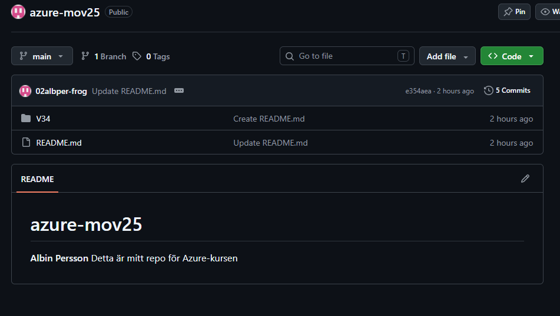
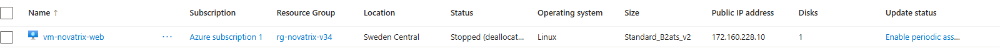
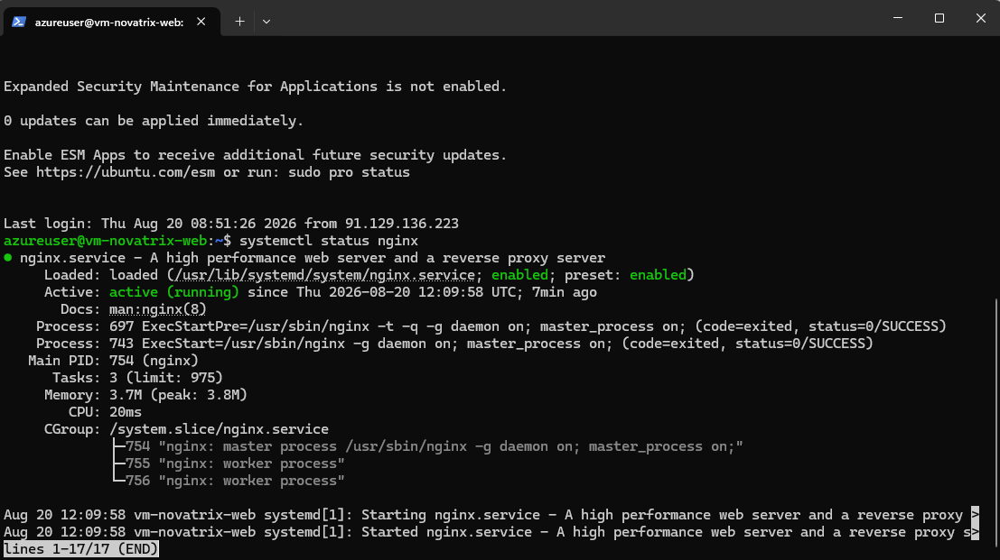
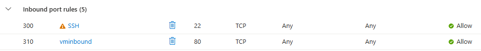
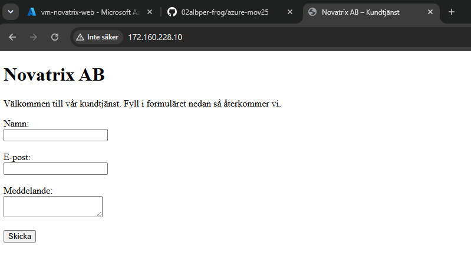
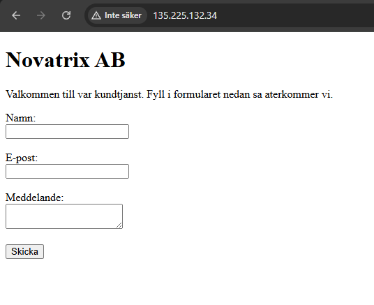

# Azure – Uppgift 1

**Namn:** Albin Persson
**Kurs:** Azure v.34

## Delmoment 1 – Sätt upp kursrepo på GitHub

Jag skapade ett publikt GitHub-repo, `azure-novatrix`, som ska följa mig genom hela kursen. Repot innehåller en README med mitt namn, kursnamn och en översikt över veckornas mappstruktur. Varje vecka läggs i en egen undermapp med tillhörande kod och konfiguration.

**Verifiering:** Repot är publikt och nåbart.



## Delmoment 2 – Provisionera en virtuell server

Jag provisionerade en virtuell maskin i Azure baserad på Ubuntu 22.04. Jag valde storleken `Standard_B2ats_v2`, eftersom den är kostnadseffektiv och fullt tillräcklig för att köra en enkel Nginx-sida utan konstant hög belastning. Resursgrupp och VM namngavs enligt kursens namnkonvention: `rg-novatrix` och `vm-novatrix-web`.

**Verifiering:** VM:en skapades utan fel och tilldelades den publika IP-adressen `172.160.228.10`.




## Delmoment 3 – Konfigurera värdmiljön

Först så var jag tvungen och sätta behörighet på nyckeln i terminal. Det gjorde jag med följande kod:

```bash
icacls .\vm-novatrix-web_key.pem /inheritance:r
icacls .\vm-novatrix-web_key.pem /grant:r "$($env:USERNAME):R"
```

Jag anslöt till servern via SSH med kommandot:

```bash
ssh -i vm-novatrix-web_key.pem azureuser@172.160.228.10
```

Därefter installerade jag webbservern Nginx:

```bash
sudo apt update
sudo apt install -y nginx
sudo systemctl enable nginx
```

**Verifiering:** Jag kontrollerade att Nginx var igång med `sudo systemctl status nginx`, som visade status `active (running)`. Se skärmdump nedan.



## Delmoment 4 – Driftsätt kundtjänstsidan med ärendeformulär

Jag skapade en enkel webbsida, `index.html`, som presenterar Novatrix AB och innehåller ett ärendeformulär med fälten namn, e-post och meddelande. Sidan laddades upp till servern och ersatte Nginx standardsida i `/var/www/html/index.html`.

Jag fick lite problem med att ansluta till webbsidan men efter att jag öpnat port 80 fungerade det.



**Kod:**

```html
<!DOCTYPE html>
<html lang="sv">
<head>
  <meta charset="UTF-8">
  <title>Novatrix AB – Kundtjänst</title>
</head>
<body>
  <h1>Novatrix AB</h1>
  <p>Välkommen till vår kundtjänst. Fyll i formuläret nedan så återkommer vi.</p>

  <form>
    <label for="namn">Namn:</label><br>
    <input type="text" id="namn" name="namn"><br><br>

    <label for="epost">E-post:</label><br>
    <input type="email" id="epost" name="epost"><br><br>

    <label for="meddelande">Meddelande:</label><br>
    <textarea id="meddelande" name="meddelande"></textarea><br><br>

    <button type="submit">Skicka</button>
  </form>
</body>
</html>
```

**Verifiering:** Sidan är nåbar på `http://172.160.228.10` och visar Novatrix kundtjänstsida med formuläret synligt.



## Delmoment 5 – Verifiera och dokumentera

Samtliga steg ovan har verifierats löpande genom varje delmoment: VM:en är provisionerad och nåbar, Nginx körs, och kundtjänstsidan med ärendeformuläret visas korrekt på serverns publika IP.


## VG – Automatiserad provisionering

Istället för att skapa VM, installera Nginx och lägga ut sidan manuellt, automatiserade jag hela flödet med Azure CLI och cloud-init.

`deploy.sh` skapar resursgrupp och VM, och skickar med `cloud-init.yaml` som `--custom-data`. Cloud-init-filen installerar Nginx och skriver kundtjänstsidan till `/var/www/html/index.html` automatiskt vid första uppstart, utan manuella steg i portalen eller via SSH.

**Kod (deploy.sh):**

```bash
#!/bin/bash
set -e

RESOURCE_GROUP="rg-novatrix-v34"
LOCATION="swedencentral"
VM_NAME="vm-novatrix-web"
VM_SIZE="Standard_B2ats_v2"

az group create --name "$RESOURCE_GROUP" --location "$LOCATION"

az vm create \
  --resource-group "$RESOURCE_GROUP" \
  --name "$VM_NAME" \
  --image Ubuntu2204 \
  --size "$VM_SIZE" \
  --admin-username azureuser \
  --generate-ssh-keys \
  --custom-data cloud-init.yaml \
  --public-ip-sku Standard

az vm open-port \
  --resource-group "$RESOURCE_GROUP" \
  --name "$VM_NAME" \
  --port 80 \
  --priority 900

az vm show -d \
  --resource-group "$RESOURCE_GROUP" \
  --name "$VM_NAME" \
  --query publicIps -o tsv
```

**Kod (cloud-init.yaml):**

```yaml
#cloud-config
package_update: true
packages:
  - nginx
write_files:
  - path: /var/www/html/index.html
    content: |
      [se fullständig HTML i cloud-init.yaml i repot, utan å/ä/ö av kodningsskäl, se felsökning nedan]
runcmd:
  - systemctl enable nginx
  - systemctl restart nginx
```

**Testat på två sätt:**

Jag testade provisioneringen på två sätt, med samma Azure CLI-kommandon men i olika terminalmiljöer, för att säkerställa att lösningen fungerar oavsett vilket skal som används.

*Försök 1 – manuellt i PowerShell:* Min VS Code-terminal använde från början PowerShell, som inte kan köra bash-skript direkt. Jag körde därför kommandona från `deploy.sh` manuellt, ett i taget, i PowerShell:

```powershell
az group create --name rg-novatrix-v34 --location swedencentral

az vm create --resource-group rg-novatrix-v34 --name vm-novatrix-web --image Ubuntu2204 --size Standard_B2ats_v2 --admin-username azureuser --generate-ssh-keys --custom-data cloud-init.yaml --public-ip-sku Standard

az vm open-port --resource-group rg-novatrix-v34 --name vm-novatrix-web --port 80 --priority 900

az vm show -d --resource-group rg-novatrix-v34 --name vm-novatrix-web --query publicIps -o tsv
```

Vid det här försöket stötte jag på ett kodningsfel (`'latin-1' codec can't encode characters`) orsakat av svenska tecken (å, ä, ö) i `cloud-init.yaml`, ett känt problem med hur PowerShell hanterar teckenkodning mot Azure CLI på Windows. Jag löste det genom att ersätta de svenska tecknen med vanliga bokstäver i `cloud-init.yaml`. HTML-koden i Delmoment 4 (den manuella installationen) behöll sina svenska tecken eftersom den laddades upp via `scp` istället för `--custom-data`, och stötte därför inte på samma kodningsbegränsning.

*Försök 2 – automatiserat med Git Bash:* Jag bytte sedan terminal till Git Bash i VS Code, som stödjer bash-syntax. Där kunde jag köra hela skriptet i ett enda kommando:

```bash
bash deploy.sh
```

Skriptet körde igenom hela flödet, resursgrupp, VM, port-öppning, utskrift av publik IP, helt automatiserat utan manuella steg, och utan kodningsproblemet som uppstod i PowerShell.

Hela miljön kan alltså återskapas från repot antingen med `bash deploy.sh` i en bash-kompatibel terminal (Git Bash eller WSL) eller genom att köra motsvarande kommandon manuellt i PowerShell.

**Verifiering:** Efter båda körningarna var VM:en, Nginx och kundtjänstsidan igång och nåbara på den publika IP:n inom någon minut, utan manuella installationssteg i portalen eller via SSH.



