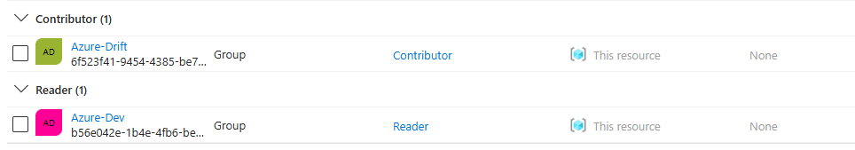
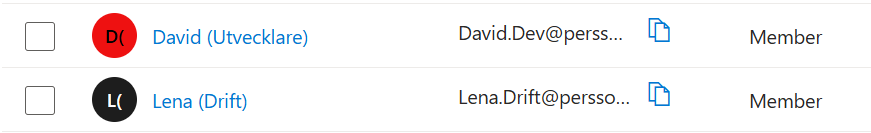
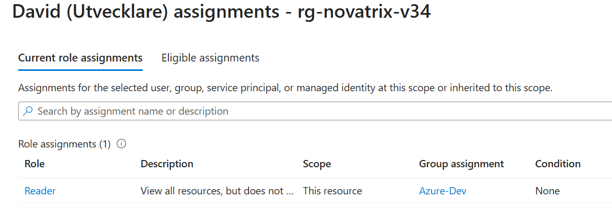
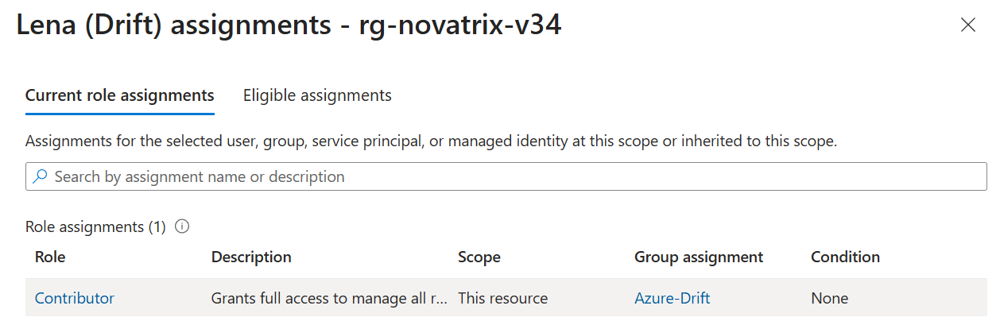
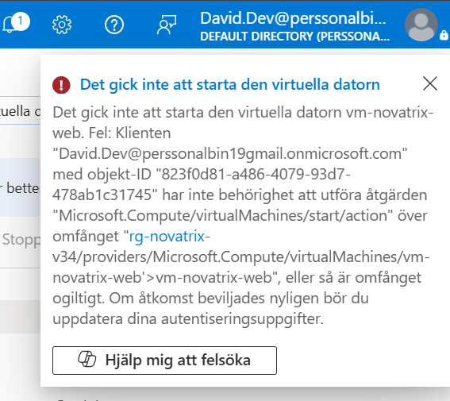
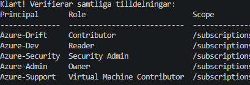

# Azure – Uppgift 2

**Namn:** Albin Persson
**Kurs:** Azure v.35

## Delmoment 1 – Repo

Skapade V35-mappen i repot och uppdaterade huvud-README med länk till denna dokumentation.

**Verifiering:** Mappen och länken syns korrekt på GitHub.

## Delmoment 2 – Skapa identiteter

Jag skapade användare och säkerhetsgrupper i Entra ID för att representera Novatrix olika roller.

**Skapa användare:** Gå till Användare, klicka "Ny användare" → välj "Skapa ny användare" → ange användarnamn och visningsnamn (t.ex. Lena Drift) → sätt ett lösenord (eller låt Azure generera ett) → klicka "Granska + skapa", och sedan "Skapa".

**Skapa grupper:** Gå till Grupper, klicka "Ny grupp" → grupptyp: Säkerhet (inte Microsoft 365) → ange gruppnamn → klicka "Skapa".

Jag skapade följande användare och grupper:

| Typ | Namn | Roll |
|---|---|---|
| Användare | David | Utvecklare |
| Användare | Lena | Drift |
| Grupp | Azure-Dev | Utvecklingsteam |
| Grupp | Azure-Drift | Driftteam |

David lades till i gruppen Azure-Dev och Lena i gruppen Azure-Drift.

**Verifiering:** Användarna och grupperna syns i Entra ID, med rätt medlemskap.




## Delmoment 3 – Tilldela behörigheter (RBAC)

Jag satte behörigheterna på resursgruppsnivå under Access Control (IAM), så att de bara gäller där, inte på hela prenumerationen. Jag tilldelade rollen **Reader** till gruppen Azure-Dev och rollen **Contributor** till gruppen Azure-Drift.

**Motivering (least privilege):**

| Grupp | Roll | Motivering |
|---|---|---|
| Azure-Dev | Reader | Utvecklare behöver kunna se resurser och konfiguration för felsökning, men inte ändra något i miljön. |
| Azure-Drift | Contributor | Driftteamet behöver kunna skapa, ändra och hantera resurser i den dagliga driften, men får inte hantera behörigheter eller åtkomst (det kräver Owner, som ingen av grupperna har). |

**Verifiering:** Rolltilldelningarna syns under Access Control (IAM) på resursgruppen.

 

## Delmoment 4 – Förbered en identitet för appen

Jag skapade en **user-assigned managed identity**, `id-novatrix-app`, som applikationen senare (v37) ska använda för att nå lagringen utan lösenord i koden.

```bash
az identity create --name id-novatrix-app --resource-group rg-novatrix-v34
```

Jag sparade `clientId` och `principalId` från utskriften, så att jag senare kan koppla identiteten och ge den behörighet till storage-kontot i v37. Identiteten har medvetet inga behörigheter ännu.

**Verifiering:** Identiteten syns i resursgruppen `rg-novatrix-v34`. Jag kontrollerade även att den saknar rolltilldelningar med:

```bash
az role assignment list --assignee <principalId> -o table
```

vilket gav en tom lista, precis som förväntat.


## Delmoment 5 – Verifiera och dokumentera

För att verifiera att behörighetsmodellens avgränsningar fungerar i praktiken genomfördes praktiska tester med testanvändarna David (Utvecklare, `Reader`) och Lena (Drift, `Contributor`).

### 1. Verifieringsmatris för Least Privilege

| Testad användare | Grupp & Roll | Handling | Förväntat resultat | Faktiskt utfall |
| :--- | :--- | :--- | :--- | :--- |
| **David** | `Azure-Dev` (`Reader`) | Se resurser och konfiguration i `rg-novatrix-v34`. | **Tillåtet** | Framgångsrikt. Kan läsa all konfiguration för felsökning. |
| **David** | `Azure-Dev` (`Reader`) | Starta den virtuella datorn `vm-novatrix-web`. | **Nekat** | **Nekat.** Åtkomst stoppades direkt av Azure RBAC. |
| **Lena** | `Azure-Drift` (`Contributor`) | Starta, stoppa och ändra resurser i resursgruppen. | **Tillåtet** | Framgångsrikt. Full driftmässig hantering. |
| **Lena** | `Azure-Drift` (`Contributor`) | Ge rolltilldelningar till andra användare i IAM. | **Nekat** | **Nekat.** Tilldelning av roller kräver `Owner`. |

---

### 2. Verifieringseksempel: Nekad start av virtuell maskin

Vid försök att starta den virtuella datorn `vm-novatrix-web` som användaren **David** (med enbart `Reader`-roll) spärras åtgärden av Azure Resource Manager:



## VG – Skalbar least privilege-modell

**Beskrivning**  
Behörighetsmodellen har utökats till fem dedikerade grupper i Entra ID. Samtliga rolltilldelningar appliceras automatiserat via Azure CLI (`rbac-setup.sh`) för att strikt efterleva principen om minsta möjliga behörighet (Least Privilege) och automatiserad infrastruktur.

| Grupp | Tilldelad roll | Motivering & Omfång |
| :--- | :--- | :--- |
| **Azure-Dev** | `Reader` | Läsrättigheter för att granska konfigurationer och felsöka, utan möjlighet att ändra resurser. |
| **Azure-Drift** | `Contributor` | Fulla rättigheter att skapa, ändra och hantera resurser inom den dagliga driften. |
| **Azure-Security** | `Security Admin` | Åtgärdar säkerhetsrekommendationer och hanterar policys utan direkt tillgång till resursernas data/drift. |
| **Azure-Admin** | `Owner` | Fullständiga rättigheter inklusive hantering av behörigheter (IAM). Begränsat till ett fåtal behöriga. |
| **Azure-Support** | `Virtual Machine Contributor` | Avgränsad roll för att hantera och starta om virtuella maskiner, utan tillgång till nätverk eller lagring. |

---

**Verifiering**  
Fullständig exekvering och kontroll sker via `rbac-setup.sh`. Tilldelningarna verifieras i mätbar vy nedan via `az role assignment list`:



---

**Skalbarhet & Förvaltning**  
Modellen är byggd för att enkelt skala i takt med att Novatrix växer. Om ett nytt team (exempelvis ett produktteam) tillkommer krävs enbart skapandet av en ny Entra ID-grupp samt en motsvarande rad i `rbac-setup.sh`.

Att hantera behörigheter på **gruppnivå via kod** framför manuell tilldelning på individnivå i Azure-portalen ger tre stora fördelar:
* **Versionshantering:** Alla ändringar i behörighetsstrukturen spåras direkt i Git.
* **Spårbarhet & Revisionsduglighet:** Tydlig överblick över vem som har tillgång till vad genom gruppmedlemskap.
* **Reproducerbarhet:** Identiska behörighetsmodeller kan på sekunder appliceras på nya resurser eller testmiljöer.