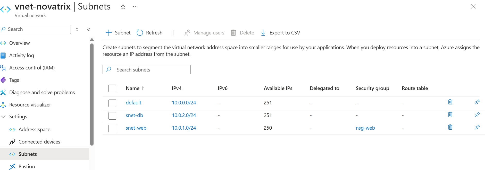
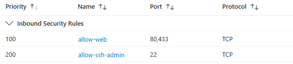
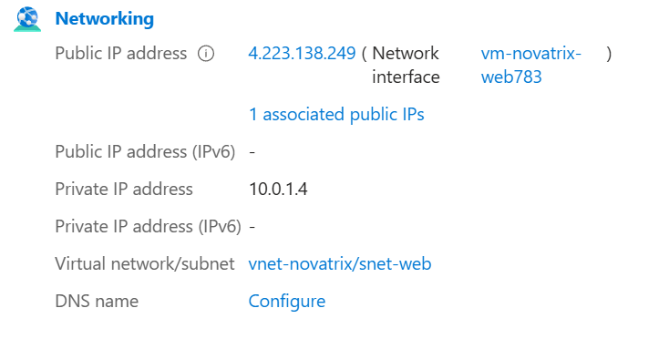
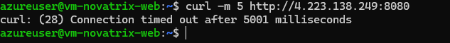

# Azure – Uppgift 3

**Namn:** Albin Persson
**Kurs:** Azure v.36

## Delmoment 1 – Repo

Skapade V36-mappen i repot och uppdaterade huvud-README med länk till denna dokumentation.

**Verifiering:** Mappen och länken syns korrekt på GitHub.

## Delmoment 2 – Bygg det virtuella nätverket

Jag skapade ett virtuellt nätverk och två subnät i Azure-portalen för att separera den publika webbapplikationen från det känsliga bakomliggande nätverket.

**Skapa VNet och subnät:** Gå till Virtuella nätverk, klicka "Skapa" → välj resursgrupp `rg-novatrix-v34`, namn `vnet-novatrix` och region `Sweden Central` → under IP-adresser, ange `10.0.0.0/16` → lägg till subnäten `snet-web` (`10.0.1.0/24`) och `snet-db` (`10.0.2.0/24`) → klicka "Granska + skapa", och sedan "Skapa".

Jag skapade följande nätverksstruktur:

| Nätverksresurs | Adressrymd / CIDR | Syfte |
|---|---|---|
| **VNet (`vnet-novatrix`)** | `10.0.0.0/16` | Övergripande nätverksgräns för Novatrix infrastruktur. |
| **Subnät (`snet-web`)** | `10.0.1.0/24` | Publikt subnät för webbserver och ärendeformulär. |
| **Subnät (`snet-db`)** | `10.0.2.0/24` | Privat subnät isolerat för framtida lagring och backend. |

**Verifiering:** VNet och båda subnäten syns under Virtuella nätverk i Azure-portalen.

## Delmoment 3 – Säkra trafiken

Jag skapade en Network Security Group (`nsg-web`) i portalen och kopplade den till webb-subnätet för att begränsa inkommande trafik utifrån principen om minsta behörighet (Least Privilege). Subnätet `snet-db` hålls helt privat genom att sakna publika IP-adresser och direkt exponering mot internet.

**Skapa och konfigurera NSG:** Gå till Nätverkssäkerhetsgrupper, klicka "Skapa" → skapa `nsg-web` i `rg-novatrix-v34` (region `Sweden Central`) → öppna `nsg-web` och lägg till inkommande säkerhetsregler → gå till Virtuella nätverk (`vnet-novatrix`), välj Subnät och koppla `nsg-web` till `snet-web`.

**Regler för `nsg-web` (snet-web):**

| Prioritet | Namn | Port | Källa | Åtgärd | Motivering |
|---|---|---|---|---|---|
| 100 | Allow-Web | 80 (TCP) | Service Tag: Internet | Allow | Tillåter publika användare att nå ärendeformuläret i webbläsaren. |
| 100 | Allow-web | 443 (TCP) | Service Tag: Internet | Allow | Förbereder för framtida krypterad HTTPS-trafik. |
| 200 | Allow-SSH-Admin | 22 (TCP) | IP: `<Admin-IP>` | Allow | Begränsar administrativ SSH-inloggning till min specifika IP-adress för att förhindra brute-force. |

**Säkerhet för `snet-db`:**  
Subnätet `snet-db` hålls helt isolerat från internet genom att inga resurser tilldelas publika IP-adresser. All direkt inkommande trafik utifrån spärras av Azures inbyggda standardregler.

**Verifiering:** Reglerna syns under Inkommande säkerhetsregler och `nsg-web` syns som kopplad under subnätsöversikten.

## Delmoment 4 – Placera lösningen i nätverket

Jag raderade den gamla virtuella datorn men behöll den befintliga OS-disken (`vm-novatrix-web_OsDisk_1_...`) för att bevara Nginx och ärendeformuläret utan att behöva konfigurera om allt. Därefter skapade jag en ny VM utifrån den sparade disken och placerade den i det nya publika subnätet `snet-web`.

**Lösning på zonkonflikt:** Vid skapandet av maskinen krävde portalen att en Availability Zone valdes (Zon 1–3), men eftersom den sparade disken saknade zon-redundans avbröts valideringen. Problemet löstes genom att ändra inställningen under **Availability options** till *"No infrastructure redundancy required"*, vilket tog bort kravet på zonval och lät mig slutföra skapandet i `vnet-novatrix`.

**Verifiering:** Den virtuella datorn `vm-novatrix-web` körs i `vnet-novatrix` på subnätet `snet-web` med skydd av `nsg-web`.

## Delmoment 5 – Verifiera och dokumentera

För att verifiera att nätverkssegmenteringen och säkerhetsreglerna fungerar i praktiken genomfördes praktiska tester mot den virtuella datorns publika IP-adress.

### 1. Verifieringsmatris för Nätverk & Säkerhet

| Testfall | Handling / Anrop | Förväntat resultat | Faktiskt utfall |
| :--- | :--- | :--- | :--- |
| **Webbåtkomst (HTTP)** | Surfa till `http://<PUBLIK-IP>` i webbläsaren. | **Tillåtet** | Framgångsrikt. Ärendeformuläret laddas direkt. |
| **Admin SSH (Behörig IP)** | Anslut via SSH från min egna IP-adress. | **Tillåtet** | Framgångsrikt. Anslutning och inloggning beviljas. |
| **Blockerad port (NSG)** | Anrop mot opublicerad port (t.ex. port 8080). | **Nekat** | **Nekat.** Anropet tajmar ut (`Connection timed out`). |

---

### 2. Verifieringsexempel: Webbsida och blockerad trafik

Webbservern är tillgänglig från internet på port 80:

Vid försök att ansluta till en opublicerad port stoppas trafiken direkt av `nsg-web`:

