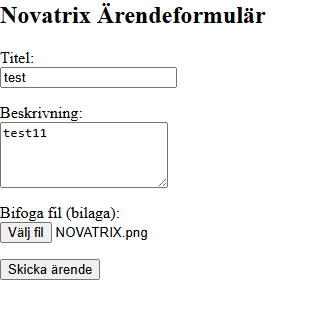
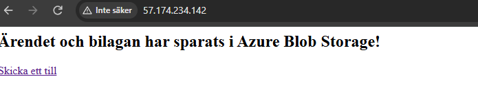
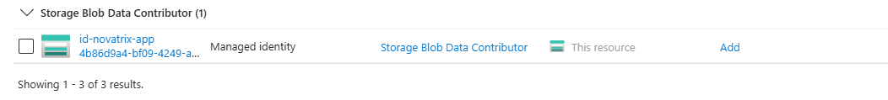
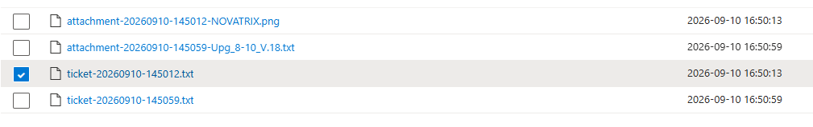

# Azure – Uppgift 4

**Namn:** Albin Persson
**Kurs:** Azure v.37

 ## Delmoment 1, Repo

Skapade V37-mappen i repot och uppdaterade huvud-README med länk till denna dokumentation.

**Verifiering:** Mappen och länken syns korrekt på GitHub.

## Delmoment 2, Skapa lagring

Skapat ett Azure Storage Account (`stnovatrixv37`) i resursgruppen `rg-novatrix-v34`. Därefter skapades en privat blob-container med namnet `tickets` för att ta emot och lagra inskickade ärenden.

**Verifiering:** Containern `tickets` visas som aktiv i Azure-portalen under *Containers* i lagringskontot.

## Delmoment 3, Koppla formuläret till lagringen

Utvecklat en Python/Flask-applikation (`app.py`) på webbservern (`vm-novatrix-web`) med stöd för både textbaserade ärenden och filuppladdning/bilagor via `multipart/form-data`. 

Vid inskickning hanterar applikationen uppladdningen i två steg via Azures Python SDK (`azure-storage-blob`):
1. **Ärendedata:** Skapar och laddar upp en `.txt`-fil (`ticket-YYYYMMDD-HHMMSS.txt`) med ärendets titel, tidsstämpel och beskrivning.
2. **Bilaga:** Om en fil bifogas laddas den upp som en separat blob med formatet `attachment-YYYYMMDD-HHMMSS-<filnamn>`.

### Nginx Reverse Proxy & Konfiguration
Nginx har konfigurerats som reverse proxy för att vidarebefordra all inkommande HTTP-trafik från standardporten (port 80) till Flask-applikationen på port 5000. 

För att stödja större bilagor har Nginx-konfigurationen anpassats med parametern `client_max_body_size 20M;`, vilket tillåter filuppladdningar upp till 20 MB och förhindrar fel gällande filstorleksgränser (HTTP 413).

**Verifiering:** Webbsidan nås direkt via `http://<VM_PUBLIC_IP>` utan att ange portnummer. Vid inskickat formulär med bilaga returnerar applikationen bekräftelsen *"Ärendet och bilagan har sparats i Azure Blob Storage!"*, och båda filerna skapas i `tickets`-containern.

## Delmoment 4, Säkra åtkomsten

Tillämpat principen om Least Privilege och Zero-Trust genom att helt undvika lösenord eller hårdkodade anslutningssträngar i koden. Åtkomsten har säkrats genom att konfigurera och koppla en User-Assigned Managed Identity:

- **Skapande av Managed Identity:** Skapat den användartilldelade identiteten `id-novatrix-app`.
- **Koppling till VM:** Tilldelat och kopplat `id-novatrix-app` till den virtuella maskinen `vm-novatrix-web` under fliken *Identitet (User assigned)*.
- **RBAC-koppling till lagring:** Tilldelat rollen **Storage Blob Data Contributor** till `id-novatrix-app` på containernivå (`tickets`) under *Åtkomstkontroll (IAM)*.
- **SDK-autentisering:** Python-koden använder `DefaultAzureCredential()` från `azure-identity`, vilket automatiskt använder VM:ens tillkopplade identitet (`id-novatrix-app`) för att autentisera mot Azure Blob Storage.

**Verifiering:** Rolltilldelningen visas under **Åtkomstkontroll (IAM)** inne på containern `tickets` där `id-novatrix-app` står angiven som *Storage Blob Data Contributor*, och koden kan ladda upp filer helt utan anslutningssträngar eller nycklar.

## Delmoment 5, Verifiera och dokumentera

Genomfört ett end-to-end-test genom att skicka in ett testärende via webbformuläret och därefter verifierat datalagringen i skyet.

**Verifiering:**
1. Navigerat till lagringskontot i Azure-portalen -> **Containers** -> `tickets`.
2. Bekräftat att den nya filen (t.ex. `ticket-20260910-100424.txt`) har skapats i containern.
3. Öppnat filen via **View/Edit** i portalen och verifierat att formulärets titel och beskrivning har sparats korrekt.

