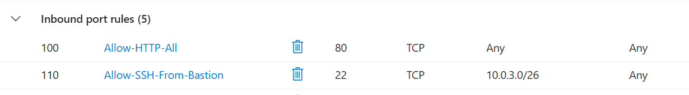
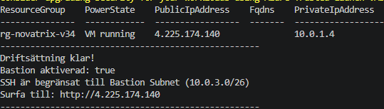
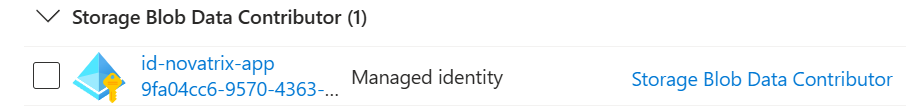
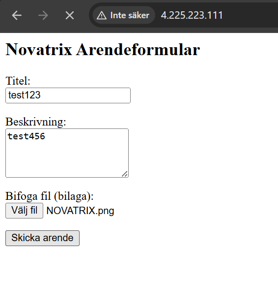
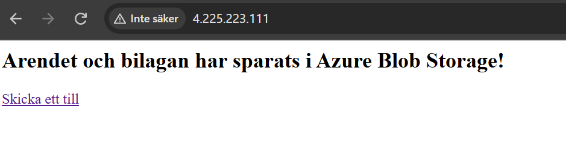
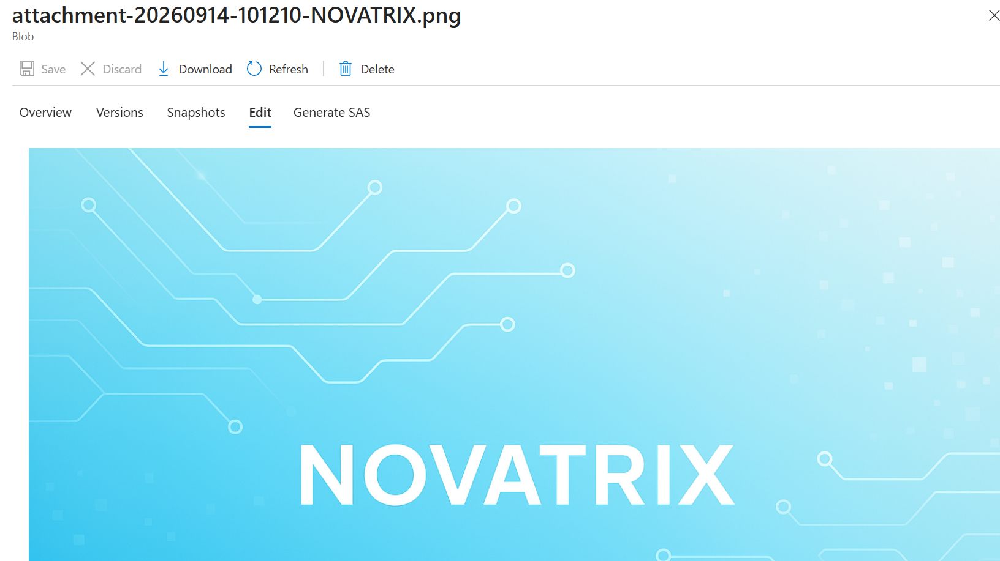
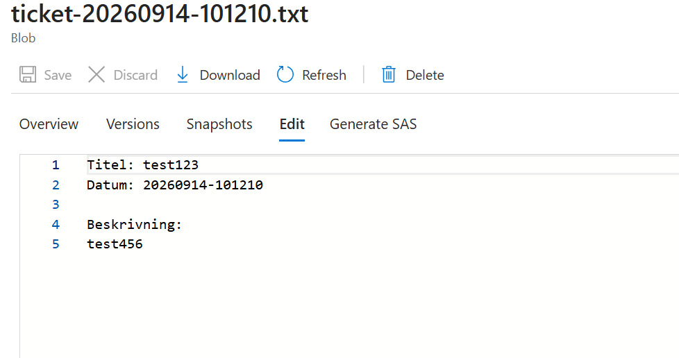
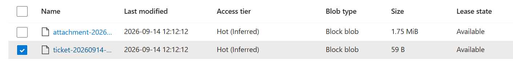

# Azure – Uppgift 4

**Namn:** Albin Persson
**Kurs:** Azure v.37

 ## Delmoment 1, Repo

Skapade V37-mappen i repot och uppdaterade huvud-README med länk till denna dokumentation.

**Verifiering:** Mappen och länken syns korrekt på GitHub.

## Delmoment 2, Skapa lagring

Skapat ett Azure Storage Account (`stnovatrixv37`) i resursgruppen `rg-novatrix-v34`. Därefter skapades en privat blob-container med namnet `tickets` för att ta emot och lagra inskickade ärenden.

**Verifiering:** Containern `tickets` visas som aktiv i Azure-portalen under *Containers* i lagringskontot.

## Delmoment 3, Koppla formuläret till lagringen

Utvecklat en Python/Flask-applikation (`app.py`) på webbservern (`vm-novatrix-web`) med stöd för både textbaserade ärenden och filuppladdning/bilagor via `multipart/form-data`. 

Vid inskickning hanterar applikationen uppladdningen i två steg via Azures Python SDK (`azure-storage-blob`):
1. **Ärendedata:** Skapar och laddar upp en `.txt`-fil (`ticket-YYYYMMDD-HHMMSS.txt`) med ärendets titel, tidsstämpel och beskrivning.
2. **Bilaga:** Om en fil bifogas laddas den upp som en separat blob med formatet `attachment-YYYYMMDD-HHMMSS-<filnamn>`.

### Nginx Reverse Proxy & Konfiguration
Nginx har konfigurerats som reverse proxy för att vidarebefordra all inkommande HTTP-trafik från standardporten (port 80) till Flask-applikationen på port 5000. 

För att stödja större bilagor har Nginx-konfigurationen anpassats med parametern `client_max_body_size 20M;`, vilket tillåter filuppladdningar upp till 20 MB och förhindrar fel gällande filstorleksgränser (HTTP 413).

**Verifiering:** Webbsidan nås direkt via `http://<VM_PUBLIC_IP>` utan att ange portnummer. Vid inskickat formulär med bilaga returnerar applikationen bekräftelsen *"Ärendet och bilagan har sparats i Azure Blob Storage!"*, och båda filerna skapas i `tickets`-containern.

## Delmoment 4, Säkra åtkomsten

Tillämpat principen om Least Privilege och Zero-Trust genom att helt undvika lösenord eller hårdkodade anslutningssträngar i koden. Åtkomsten har säkrats genom att konfigurera och koppla en User-Assigned Managed Identity:

- **Skapande av Managed Identity:** Skapat den användartilldelade identiteten `id-novatrix-app`.
- **Koppling till VM:** Tilldelat och kopplat `id-novatrix-app` till den virtuella maskinen `vm-novatrix-web` under fliken *Identitet (User assigned)*.
- **RBAC-koppling till lagring:** Tilldelat rollen **Storage Blob Data Contributor** till `id-novatrix-app` på containernivå (`tickets`) under *Åtkomstkontroll (IAM)*.
- **SDK-autentisering:** Python-koden använder `DefaultAzureCredential()` från `azure-identity`, vilket automatiskt använder VM:ens tillkopplade identitet (`id-novatrix-app`) för att autentisera mot Azure Blob Storage.

**Verifiering:** Rolltilldelningen visas under **Åtkomstkontroll (IAM)** inne på containern `tickets` där `id-novatrix-app` står angiven som *Storage Blob Data Contributor*, och koden kan ladda upp filer helt utan anslutningssträngar eller nycklar.

## Delmoment 5, Verifiera och dokumentera

Genomfört ett end-to-end-test genom att skicka in ett testärende via webbformuläret och därefter verifierat datalagringen i skyet.

**Verifiering:**
1. Navigerat till lagringskontot i Azure-portalen -> **Containers** -> `tickets`.
2. Bekräftat att den nya filen (t.ex. `ticket-20260910-100424.txt`) har skapats i containern.
3. Öppnat filen via **View/Edit** i portalen och verifierat att formulärets titel och beskrivning har sparats korrekt.

## VG-Krav: Arkitekturmotivering, Lagring & Säkerhetsanalys

För att uppnå kraven för Väl Godkänd (VG) har hela infrastrukturen och lagringslösningen utformats utifrån principerna för **Defense in Depth**, **Least Privilege**, kostnadseffektivitet och fullständig **Infrastructure as Code (IaC)**.

---

### 1. Motiverat Val av Lagringsnivå (Kostnad vs. Prestanda)

I enlighet med VG-utmaningen har valen för Azure Blob Storage optimerats för applikationens specifika belastningsprofil:

* **SKU & Prestandanivå (`Standard_LRS`):**
  * **Motivering:** Applikationen hanterar textbaserade ärenden och mindre filbilagor. Att välja *Premium* (SSD-baserad) lagring hade inneburit en avsevärt högre fast månadskostnad utan märkbar prestandavinst för denna typ av I/O-mönster. *Standard (HDD)* ger fullt tillräcklig genomströmning och låg latens till en bråkdel av priset.
  * **Redundans:** *LRS (Locally Redundant Storage)* valdes för att minimera kostnaden under utvecklings- och testfasen, samtidigt som det ger 11 nior (99,999999999 %) datahållbarhet inom datacentret.
* **Åtkomstnivå (Access Tier: `Hot`):**
  * **Motivering:** Ärenden och bilagor läses och skrivs direkt när de skapas av användarna. `Hot`-nivån har lägre transaktionskostnader vid läsning/skrivning jämfört med `Cool` eller `Archive`, vilket gör den mest kostnadseffektiv för data som nås frekvent vid skapande och handläggning.

---

### 2. Säkrad Åtkomst via Managed Identity & Least Privilege

I stället för osäkra åtkomstnycklar (*Access Keys*) eller hårdkodade anslutningssträngar (*Connection Strings*) säkras all dataåtkomst helt nyckellöst:

* **User-Assigned Managed Identity (`id-novatrix-app`):**
  * Identiteten frikopplas från VM-livscykeln och tilldelas den virtuella maskinen vid driftsättning.
  * Flask-applikationen autentiserar sig sömlöst via SDK:ns `DefaultAzureCredential()`, vilket helt eliminerar risken för att hemligheter läcker via källkod eller versionshantering.
* **Strikt RBAC med Least Privilege (Container Scope):**
  * Rollen **`Storage Blob Data Contributor`** tilldelas *inte* på resursgrupps- eller lagringskontonivå.
  * Behörigheten begränsas strikt till målcontainern via dess exakta scope:
    `.../blobServices/default/containers/tickets`
  * Detta garanterar att applikationen enbart har skriv- och läsrättigheter i containern `tickets` och helt saknar tillgång till övriga delar av lagringskontot eller Azure-miljön.

---

### 3. Nätverkssegmentering & Defense in Depth

* **Uppdelade subnät:** Virtuellt nätverk (`vnet-novatrix`) är uppdelat i två dedikerade subnät:
  * `snet-web` (`10.0.1.0/24`): För offentliga webbresurser.
  * `snet-db` (`10.0.2.0/24`): Isolerat subnät för databas/backend-resurser.
* **Subnätskopplade NSG:er:** Säkerhetsgrupper är applicerade direkt på subnätsnivå (`nsg-web` och `nsg-db`) istället för på enskilda nätverkskort (NIC). Detta garanterar att alla framtida resurser som placeras i subnäten automatiskt omfattas av samma säkerhetsregler.
* **Isolering av databassubnät:** `nsg-db` tillåter enbart inkommande trafik på databasportar (3306/1433) från webbsubnätet (`10.0.1.0/24`). All direkt inkommande trafik från internet blockeras helt.

---

### 4. Begränsad Administrativ Åtkomst (SSH & Bastion)

För att skydda SSH-porten (22) från automatiserade brute force-attacker från internet stöds två säkerhetsnivåer i automatisationsskriptet:

1. **IP-begränsad SSH-åtkomst (Standardläge):**
   * Skriptet identifierar automatiskt administratörens publika IP-adress (`MY_IP`) vid körning via `curl`.
   * NSG-regeln `Allow-SSH-MyIP` tillåter enbart inkommande SSH-trafik från den specifika IP-adressen (`$MY_IP/32`). All annan SSH-trafik nekas.
2. **Azure Bastion (Inbyggt stöd):**
   * Skriptet innehåller en flagga (`ENABLE_BASTION=true/false`).
   * Om Bastion aktiveras skapas ett dedikerat `AzureBastionSubnet` (`10.0.3.0/26`) och en Bastion Host. NSG-regeln uppdateras då till `Allow-SSH-From-Bastion` för att enbart tillåta intern SSH-trafik från Bastion-subnätet.

---

### 5. Infrastructure as Code (IaC) & Reproducerbarhet

Lagringen och hela infrastrukturen är helt integrerad i vår IaC-uppsättning och byggs upp automatiserat via `deploy-all-v37.sh` och `cloud-init-v37.yaml`:

1. **Deklarativ skapelse:** Lagringskontot (`stnovatrixv37albin`) och containern (`tickets`) skapas automatiskt via Azure CLI med `--auth-mode login`.
2. **Dynamisk RBAC-koppling:** Skriptet hämtar resurs-ID för både identities och container scope dynamiskt vid körtillfälle och tilldelar rollen automatiserat.
3. **Applikationskonfiguration via `cloud-init`:** Genom `cloud-init` installeras nödvändiga systempaket, Python-beroenden, Nginx och en dedikerad `systemd`-tjänst (`novatrix.service`). Detta garanterar identiska driftsättningar och snabb disaster recovery.

---

### 6. Verifiering och Skärmdumpar

* **Skärmdump 1: Nätverksstruktur och NSG-regler**
  *(Visar `nsg-web` där SSH är begränsat till administratörens IP/Bastion och HTTP är öppen)*
  
  
* **Skärmdump 2: Managed Identity & Container-scope**
  *(Visar RBAC-tilldelningen för `id-novatrix-app` på containern `tickets`)*
  
* **Skärmdump 3: Applikations- och Blob Storage-verifiering**
  *(Visar webbformuläret samt de sparade ärendena/bilagorna i Azure Portal)*
  
  
  
  
  