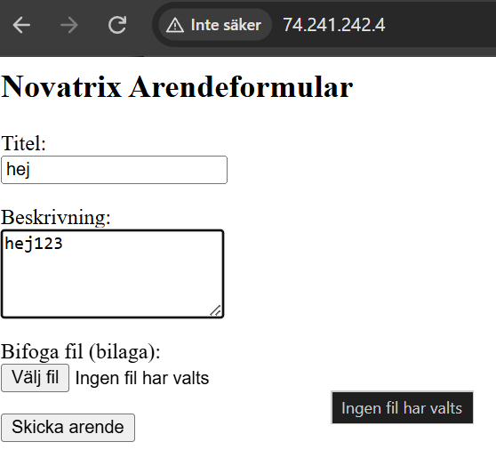
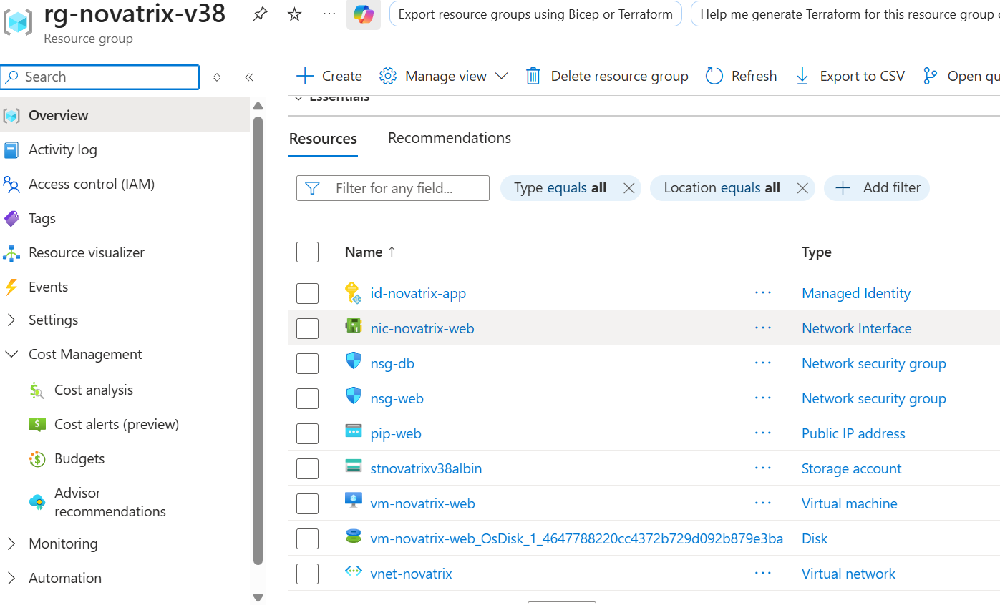
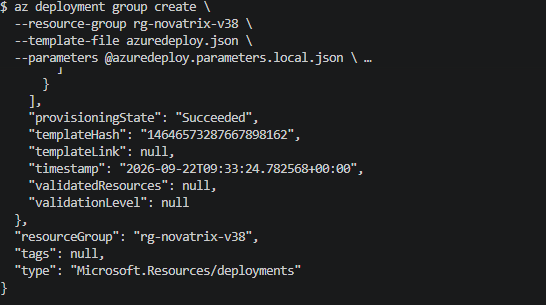
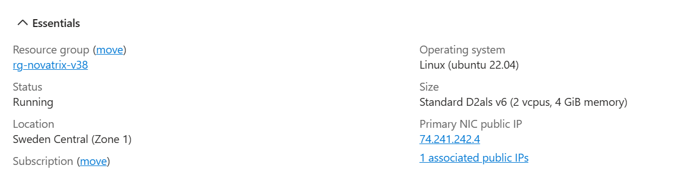
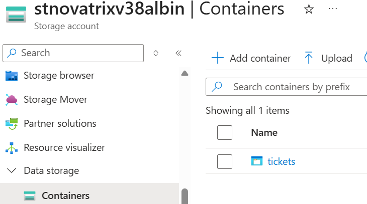
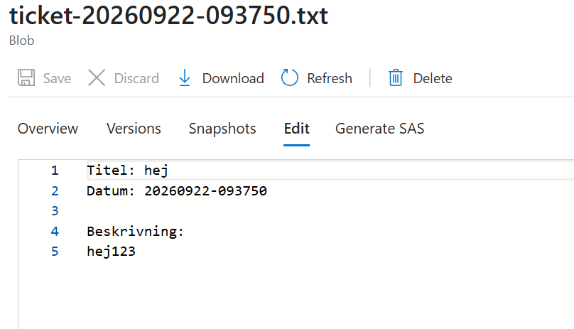

# Azure – Uppgift 5 (v38)

**Namn:** Albin Persson  
**Kurs:** Azure v.38  

## Delmoment 1, Repo

Skapade mappen `V38/` i kursrepot för att isolera och organisera alla Infrastructure as Code (IaC)-filer från tidigare veckor. Skapade även en `.gitignore` på rotnivå för att förhindra att lokala parameterfiler (`*.local.json`) och känslig information av misstag laddas upp till GitHub.

**Verifiering:** Mappen `V38/` och filerna syns korrekt på GitHub, och `.gitignore` ignorerar alla lokala parameterfiler.

---

## Delmoment 2, Skriv template(s)

Skrivit en deklarativ ARM-template (`V38/azuredeploy.json`) som definierar och provisionerar hela Novatrix miljö på ett återanvändbart sätt:

* **Virtuellt Nätverk (VNet):** `vnet-novatrix` med två uppdelade subnät (`snet-web` och `snet-db`).
* **Säkerhetsgrupp (NSG):** `nsg-web` kopplad till webbsubnätet med regler för inkommande HTTP- (`Allow-HTTP-Web`) och SSH-trafik (`Allow-SSH`), samt `nsg-db` för databassubnätet (`Allow-DB-From-Web`).
* **Lagringskonto:** `stnovatrixv38albin` med privat Blob-container `tickets`.
* **Virtuell Maskin:** Linux-VM (`vm-novatrix-web`) av storlek `Standard_D2als_v6` placerad i Availability Zone 1 i Sweden Central med Generation 2-avbildning (`22_04-lts-gen2`)[cite: 2, 3].
* **Säkerhet & Identitet:** Aktiverat **User-Assigned Managed Identity** (`id-novatrix-app`) på VM:en för nyckellös autentisering mot Blob Storage via rolltilldelning för **Storage Blob Data Contributor** på container-nivå.
* **Bootstrapping via `customData`:** Konfigurationsskriptet `cloud-init-v38.yaml` skickas in Base64-kodat till VM:en för att automatiskt installera Python 3, Flask, Azure SDK, Nginx reverse proxy och starta ärendeapplikationen.

### Utdrag från ARM-template (`V38/azuredeploy.json`)

```json
{
  "$schema": "[https://schema.management.azure.com/schemas/2019-04-01/deploymentTemplate.json#](https://schema.management.azure.com/schemas/2019-04-01/deploymentTemplate.json#)",
  "contentVersion": "1.0.0.0",
  "parameters": {
    "storageAccountName": {
      "type": "string",
      "defaultValue": "stnovatrixv38albin"
    },
    "cloudInitData": {
      "type": "string",
      "defaultValue": "",
      "metadata": { "description": "Base64-kodad cloud-init data" }
    }
  },
  "variables": {
    "vmName": "vm-novatrix-web",
    "managedIdentityName": "id-novatrix-app",
    "containerName": "tickets"
  },
  "resources": [
    {
      "type": "Microsoft.ManagedIdentity/userAssignedIdentities",
      "apiVersion": "2023-01-31",
      "name": "[variables('managedIdentityName')]",
      "location": "[parameters('location')]"
    },
    {
      "type": "Microsoft.Compute/virtualMachines",
      "apiVersion": "2023-07-01",
      "name": "[variables('vmName')]",
      "location": "[parameters('location')]",
      "zones": [ "1" ],
      "identity": {
        "type": "UserAssigned",
        "userAssignedIdentities": {
          "[resourceId('Microsoft.ManagedIdentity/userAssignedIdentities', variables('managedIdentityName'))]": {}
        }
      },
      "properties": {
        "storageProfile": {
          "imageReference": {
            "publisher": "Canonical",
            "offer": "0001-com-ubuntu-server-jammy",
            "sku": "22_04-lts-gen2",
            "version": "latest"
          }
        },
        "osProfile": {
          "computerName": "[variables('vmName')]",
          "customData": "[parameters('cloudInitData')]"
        }
      }
    }
  ]
}
```

**Verifiering:** ARM-mallen validerades utan fel via Azure CLI och täcker nätverk, säkerhet, beräkning och lagring i en enda sammanhållen fil.

---

## Delmoment 3, Deploya från kod

Driftsatt hela miljön automatiserat från terminalen via Azure CLI. Inga manuella klick i Azure Portal utfördes.

*Notering kring infrastruktur:* På grund av generell kapacitetsbrist (`SkuNotAvailable`) på äldre VM-familjer i Sweden Central anpassades deploymenten till v6-serien (`Standard_D2als_v6`) tillsammans med Gen2-OS-avbildning[cite: 2].

### Körda kommandon för deployment:

```bash
# 1. Skapa resursgrupp i Sweden Central
az group create --name rg-novatrix-v38 --location swedencentral

# 2. Deploya hela infrastrukturen med den lokala parameterfilen och överstyrd VM-storlek
az deployment group create \
  --resource-group rg-novatrix-v38 \
  --template-file azuredeploy.json \
  --parameters @azuredeploy.parameters.local.json \
  --parameters vmSize=Standard_D2als_v6 \
  --parameters cloudInitData="$(base64 -w 0 cloud-init-v38.yaml)"
```

**Verifiering:** 
1. Hämtade VM:ens publika IP-adress via Azure CLI och navigerade till den i webbläsaren.
2. Ärendeformuläret lästes in korrekt via Nginx reverse proxy på port 80.
3. Ett testärende med bifogad fil skickades in och bekräftades sparat i Blob-containern `tickets` på `stnovatrixv38albin` via User-Assigned Managed Identity (`id-novatrix-app`).





---

## Delmoment 4, Visa versionshantering

För att demonstrera ett riktigt IaC-arbetsflöde genomfördes en uppdatering i ARM-mallen `V38/azuredeploy.json` där inkommande HTTP-regel i Network Security Group (NSG) refaktorerades och döptes om från `"Allow-HTTP"` till det mer beskrivande namnet `"Allow-HTTP-Web"`.

Ändringen indexerades, committades och pushades till GitHub.

### Körda Git-kommandon:

```bash
git add V38/azuredeploy.json
git commit -m "Refactor: Rename HTTP security rule to Allow-HTTP-Web in NSG"
git push origin main
```

### Git-historik (`git log --oneline`):

```text
b3c4d5e (HEAD -> main, origin/main) Refactor: Rename HTTP security rule to Allow-HTTP-Web in NSG
a2b3c4d Chore: Remove local parameters file from tracking and apply .gitignore
192869c Feat: Add v38 ARM templates, parameters, and cloud-init config
```

### Hur versionshantering underlättar drift och samarbete:
1. **Spårbarhet & Transparens (Audit Trail):** Varje ändring i infrastrukturen registreras med vem som utförde den, när den gjordes och varför (via commit-meddelandet).
2. **Säkerhet & Återställning (Rollback):** Om en ny mallkonfiguration orsakar driftstörning kan teamet snabbt återgå till en tidigare fungerande version via `git revert`.
3. **Säkrare samarbete:** Teammedlemmar kan arbeta parallellt i separata grenar (*branches*), testa ändringar i isolerade resursgrupper och granska varandras IaC-kod via *Pull Requests* innan ändringarna slås ihop i `main`.

**Verifiering:** Git-historiken visar tydligt hela utvecklingskedjan från första mallen till refaktoreringen.

---

## Delmoment 5, Dokumentera

Hela Novatrix-miljön kan återskapas helt automatiskt från detta repository genom att följa dessa steg.

### Förutsättningar
* Azure CLI installerat och inloggat (`az login`).
* Git installerat.
* En lokal parameterfil skapad utifrån mönstret `azuredeploy.parameters.local.json` med din publika SSH-nyckel (format: `ssh-rsa AAA... användare@dator`)[cite: 3].

### Steg-för-steg:

1. **Klona repositoryt:**
   ```bash
   git clone [https://github.com/02albper-frog/azure-mov25.git](https://github.com/02albper-frog/azure-mov25.git)
   cd azure-mov25
   ```

2. **Skapa resursgrupp:**
   ```bash
   az group create --name rg-novatrix-v38 --location swedencentral
   ```

3. **Deploya infrastrukturen (IaC):**
   * **I Git Bash / Linux:**
     ```bash
     az deployment group create \
       --resource-group rg-novatrix-v38 \
       --template-file V38/azuredeploy.json \
       --parameters @V38/azuredeploy.parameters.local.json \
       --parameters vmSize=Standard_D2als_v6 \
       --parameters cloudInitData="$(base64 -w 0 V38/cloud-init-v38.yaml)"
     ```
   * **I PowerShell:**
     ```powershell
     $cloudInit = [Convert]::ToBase64String([System.IO.File]::ReadAllBytes("V38/cloud-init-v38.yaml"))
     az deployment group create `
       --resource-group rg-novatrix-v38 `
       --template-file V38/azuredeploy.json `
       --parameters @V38/azuredeploy.parameters.local.json `
       --parameters vmSize=Standard_D2als_v6 `
       --parameters cloudInitData=$cloudInit
     ```

---

## VG-Del – Arkitektur, Säkerhet och Best Practices

### 1. Säkerhet & Identitetshantering (Managed Identity vs. Access Keys)
I lösningen används en **User-Assigned Managed Identity** (`id-novatrix-app`) i kombination med Azure RBAC (**Storage Blob Data Contributor**) istället för klassiska Storage Account Access Keys:
* **Inga hårdkodade hemligheter:** Inga åtkomstnycklar eller lösenord finns lagrade i ARM-mallen, applikationskoden eller miljövariabler.
* **Automatisk nyckelrotation:** Azure hanterar livscykeln och autentiseringstoken automatiskt i bakgrunden.
* **Minsta möjliga behörighet (Principle of Least Privilege):** Identiteten tilldelas endast rollen *Storage Blob Data Contributor* på den specifika container-nivån (`tickets`), vilket förhindrar obehörig åtkomst till övriga delar av lagringskontot eller Azure-prenumerationen.

### 2. Idempotens och Deklarativ Infrastruktur
ARM-mallen är helt **deklarativ och idempotent**:
* **Förutsägbart tillstånd:** Mallen beskriver *hur* den slutgiltiga infrastrukturen ska se ut, inte *vilka steg* som ska utföras.
* **Säker återanvändning:** Om `az deployment group create` körs igen mot samma resursgrupp uppdateras endast ändrade resurser. Befintliga intakta resurser lämnas orörda utan nedtid eller förlust av data.

### 3. Separation of Concerns & Bootstrapping med cloud-init
Lösningen skiljer tydligt på **infrastruktur** och **applikationskonfiguration**:
* **Disponerbar beräkningsresurs:** VM:en fungerar som en tillståndslös (*stateless*) beräkningsnod. All varaktig data sparas direkt i Azure Blob Storage.
* **Automatiserad bootstrapping:** Genom `cloud-init-v38.yaml` installeras beroenden (Python, Flask, Nginx) och tjänster startas helt automatiskt vid första uppstart utan manuell interaktion.


