# Azure – Uppgift 6 (v39)

**Namn:** Albin Persson  
**Kurs:** Azure v.39

## Delmoment 1, Repo

Ett nytt avsnitt för vecka 39 har skapats i det lokala och publika GitHub-repot. Mappen `V39` innehåller samtliga mallar, konfigurationsfiler och applikationskod som krävs för automatisk etablering och integration. 

Alla filer med ändelsen `.local.` (såsom `cloud-init-v39.local.yaml` och `azuredeploy.parameters.local.json`) hålls exkluderade från det publika repot via `.gitignore` för att inte exponera känsliga SAS-nycklar eller API-sökvägar.

```text
V39/
├── azuredeploy.json
├── azuredeploy.parameters.json
├── azuredeploy.parameters.local.json  (Lokal fil - ej i git)
├── cloud-init-v39.local.yaml           (Lokal fil - ej i git)
├── cloud-init-v39.yaml
└── README.md
```
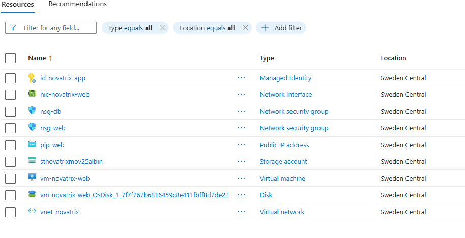
---

## Delmoment 2,

Ett automatiserat molnflöde har skapats i Power Automate som exekveras asynkront när ett nytt ärende tas emot från webbformuläret.

### Trigger-konfiguration
* **Typ:** `När en HTTP-begäran tas emot` (*When an HTTP request is received*)


### Begärans text-JSON-schema 
```json
{
    "type": "object",
    "properties": {
        "ticket_id": { "type": "string" },
        "timestamp": { "type": "string" },
        "name": { "type": "string" },
        "email": { "type": "string" },
        "subject": { "type": "string" },
        "description": { "type": "string" },
        "filename": { "type": "string" },
        "blob_url": { "type": "string" }
    }
}
```

---

## Delmoment 3, Integrera mot Microsoft 365

Flödet är direkt integrerat mot Novatrix Microsoft 365-miljö för datalagring och kommunikation:

### 1. SharePoint Online (Novatrix Ärenderegister)
* **Åtgärd:** `Skapa objekt` (*Create item*)
* **Plats:** SharePoint-webbplatsen *Novatrix Kundtjänst*
* **Lista:** `Ärenden`
* **Mappning:**
  * `Rubrik` <- `@{triggerOutputs()?['body/subject']}`
  * `ÄrendeID` <- `@{triggerOutputs()?['body/ticket_id']}`
  * `Namn` <- `@{triggerOutputs()?['body/name']}`
  * `E-post` <- `@{triggerOutputs()?['body/email']}`
  * `Beskrivning` <- `@{triggerOutputs()?['body/description']}`
  * `Filnamn` <- `@{triggerOutputs()?['body/filename']}`
  * `BlobURL` <- `@{triggerOutputs()?['body/blob_url']}`

### 2. Office 365 Outlook (Notiser)
* **Åtgärd:** `Skicka ett e-postmeddelande (V2)`
* **Supportnotis:** Skickas internt till kundtjänst med ärendeuppgifter och eventuellt bifogad fil.
* **Kundbekräftelse:** Skickas externt till kundens angivna e-postadress (`email`) med bekräftelse och tilldelat `ticket_id`.

**Flöde:**
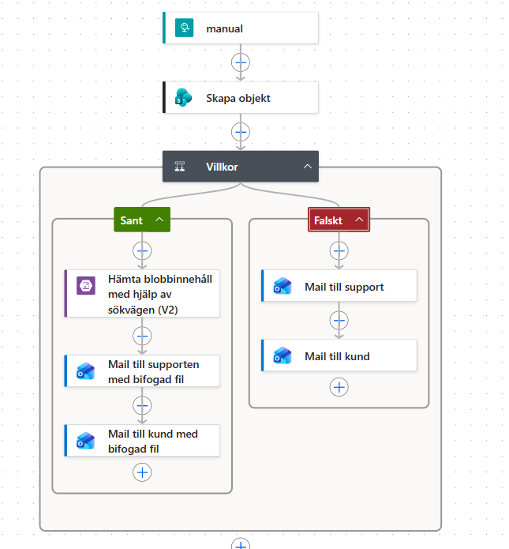

---

## Delmoment 4, Koppla ihop med Azure

Kopplingen mellan Azure och Power Automate ställs in via `cloud-init-v39.yaml` som automatiskt installerar och konfigurerar Python, Flask, Nginx och en systemd-tjänst (`novatrix.service`) på VM:en vid deployment.

### Konfiguration och applikationskod (`cloud-init-v39.yaml`, kopierbar)

```yaml
#cloud-config
package_update: true
packages:
  - python3
  - python3-pip
  - nginx

runcmd:
  - pip3 install flask azure-identity azure-storage-blob requests
  - mkdir -p /var/www/novatrix
  - |
    cat << 'EOF' > /var/www/novatrix/app.py
    import os
    import json
    import uuid
    import requests
    from datetime import datetime
    from flask import Flask, request, render_template_string
    from azure.identity import DefaultAzureCredential
    from azure.storage.blob import BlobServiceClient

    app = Flask(__name__)

    # Konfiguration
    ACCOUNT_NAME = "stnovatrixmov25albin"
    CONTAINER_NAME = "tickets"
    STORAGE_URL = f"https://{ACCOUNT_NAME}.blob.core.windows.net"

    # HTTP POST URL från Power Automate
    POWER_AUTOMATE_URL = "https://<POWER_AUTOMATE_HTTP_TRIGGER_URL_MED_SAS_TOKEN>"

    HTML_FORM = """
    <!DOCTYPE html>
    <html>
    <head>
        <title>Novatrix Kundtjänst</title>
        <style>
            body { font-family: Arial, sans-serif; margin: 40px; background-color: #f4f4f9; }
            .container { max-width: 500px; background: white; padding: 20px; border-radius: 8px; box-shadow: 0 0 10px rgba(0,0,0,0.1); }
            h2 { color: #333; }
            label { font-weight: bold; display: block; margin-top: 10px; }
            input, textarea { width: 100%; padding: 8px; margin-top: 5px; box-sizing: border-box; }
            button { margin-top: 15px; padding: 10px 15px; background: #0078d4; color: white; border: none; border-radius: 4px; cursor: pointer; }
            button:hover { background: #005a9e; }
            .success { color: green; font-weight: bold; padding: 10px; background-color: #e7f4e4; border-radius: 4px; }
        </style>
    </head>
    <body>
        <div class="container">
            <h2>Novatrix Ärendeformulär</h2>
            <p class="success">{{ message }}</p>
            <form method="POST" action="/submit" enctype="multipart/form-data">
                <label>Namn:</label>
                <input type="text" name="name" required>
                
                <label>E-post:</label>
                <input type="email" name="email" required>
                
                <label>Ämne:</label>
                <input type="text" name="subject" required>
                
                <label>Beskrivning:</label>
                <textarea name="description" rows="4" required></textarea>
                
                <label>Bifoga fil (valfritt):</label>
                <input type="file" name="file">
                
                <button type="submit">Skicka ärende</button>
            </form>
        </div>
    </body>
    </html>
    """

    @app.route('/', methods=['GET'])
    def index():
        return render_template_string(HTML_FORM)

    @app.route('/submit', methods=['POST'])
    def submit():
        name = request.form.get('name')
        email = request.form.get('email')
        subject = request.form.get('subject')
        description = request.form.get('description')
        uploaded_file = request.files.get('file')
        
        # Generera unikt Ärende-ID och tidsstämpel
        arende_id = f"NOV-{uuid.uuid4().hex[:6].upper()}"
        timestamp = datetime.now().strftime("%Y-%m-%d %H:%M:%S")
        
        blob_url = ""
        filnamn = ""

        credential = DefaultAzureCredential()
        blob_service_client = BlobServiceClient(account_url=STORAGE_URL, credential=credential)

        # 1. Spara bifogad fil i Blob Storage (om den finns)
        if uploaded_file and uploaded_file.filename != '':
            filnamn = f"{arende_id}_{uploaded_file.filename}"
            blob_client = blob_service_client.get_blob_client(container=CONTAINER_NAME, blob=filnamn)
            blob_client.upload_blob(uploaded_file.stream, overwrite=True)
            blob_url = f"{STORAGE_URL}/{CONTAINER_NAME}/{filnamn}"

        # 2. Skapa JSON-objekt med svenska nycklar som matchar Power Automate & SharePoint
        ticket_data = {
            "ArendeID": arende_id,
            "Timestamp": timestamp,
            "Namn": name,
            "Epost": email,
            "Amne": subject,
            "Beskrivning": description,
            "Filnamn": filnamn,
            "BlobURL": blob_url
        }
        
        # Spara hela ärendets metadata som en JSON-fil i Blob Storage
        json_filename = f"ticket_{arende_id}.json"
        json_blob_client = blob_service_client.get_blob_client(container=CONTAINER_NAME, blob=json_filename)
        json_blob_client.upload_blob(json.dumps(ticket_data, ensure_ascii=False, indent=2), overwrite=True)

        # 3. Skicka HTTP POST till Power Automate
        try:
            if POWER_AUTOMATE_URL and "http" in POWER_AUTOMATE_URL:
                requests.post(POWER_AUTOMATE_URL, json=ticket_data, timeout=5)
        except Exception as e:
            print(f"Power Automate Trigger Error: {e}")

        return render_template_string(HTML_FORM, message=f"Tack! Ditt ärende har registrerats. Ärende-ID: {arende_id}")

    if __name__ == '__main__':
        app.run(host='127.0.0.1', port=5000)
    EOF

  # Konfigurera Nginx som Reverse Proxy till Flask
  - |
    cat << 'EOF' > /etc/nginx/sites-available/default
    server {
        listen 80 default_server;
        listen [::]:80 default_server;

        location / {
            proxy_pass [http://127.0.0.1:5000](http://127.0.0.1:5000);
            proxy_set_header Host $host;
            proxy_set_header X-Real-IP $remote_addr;
            proxy_set_header X-Forwarded-For $proxy_add_x_forwarded_for;
        }
    }
    EOF

  # Skapa systemd service för Flask
  - |
    cat << 'EOF' > /etc/systemd/system/novatrix.service
    [Unit]
    Description=Novatrix Flask Ticket Application
    After=network.target

    [Service]
    User=root
    WorkingDirectory=/var/www/novatrix
    ExecStart=/usr/bin/python3 /var/www/novatrix/app.py
    Restart=always

    [Install]
    WantedBy=multi-user.target
    EOF

  - systemctl daemon-reload
  - systemctl enable novatrix.service
  - systemctl start novatrix.service
  - systemctl restart nginx
```

---

## Delmoment 5, Verifiera och dokumentera

Hela kedjan har verifierats från inskickat formulär till utförd åtgärd i Microsoft 365.

### Flödets exekveringslogik
1. **Inkommande Webhook:** Power Automate tar emot JSON-payload med de svenska nycklarna (`ArendeID`, `Epost`, `Amne`, `Beskrivning`, `Filnamn`, `BlobURL`) från Flask.
2. **SharePoint-registrering:** Post skapas i listan *Ärenden*.
3. **Villkorsstyrning (Condition):** Flödet utvärderar uttrycket:
   ```text
   empty(triggerOutputs()?['body/Filnamn']) is equal to false
   ```
   * **Sant (Fil finns):** Flödet anropar Azure Blob Storage-donet `Hämta blobbinnehåll med hjälp av sökvägen (V2)` för sökvägen `/tickets/@{triggerOutputs()?['body/Filnamn']}`. Därefter skickas e-post till support och kund med filen bifogad.
   * **Falskt (Fil saknas):** Flödet hoppar över hämtning från Azure Blob Storage och skickar e-postnotiser direkt utan bilagor.

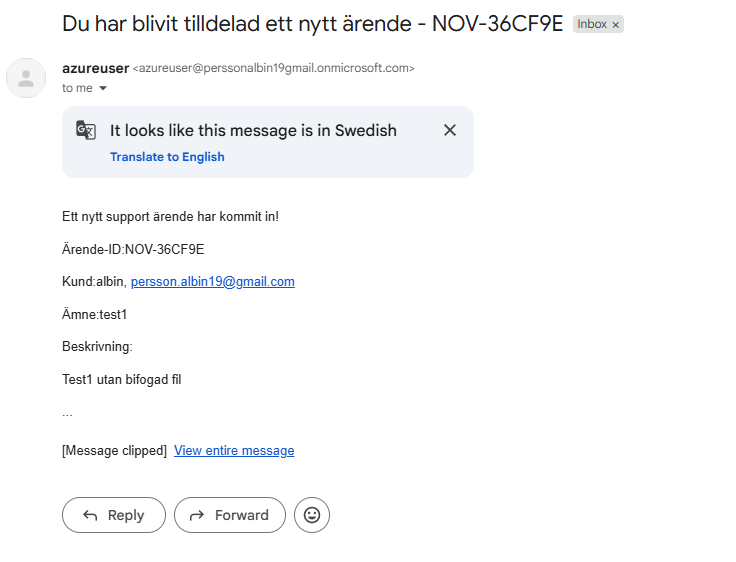
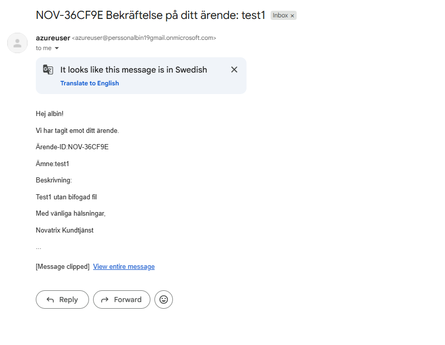

**Med bifogad fil:**
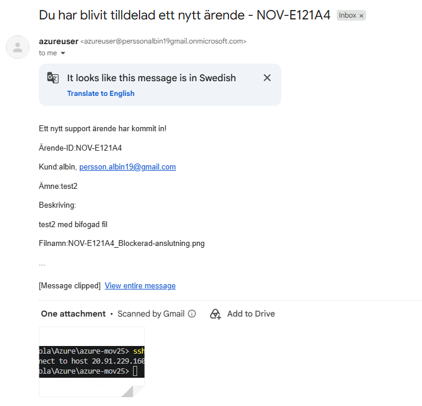
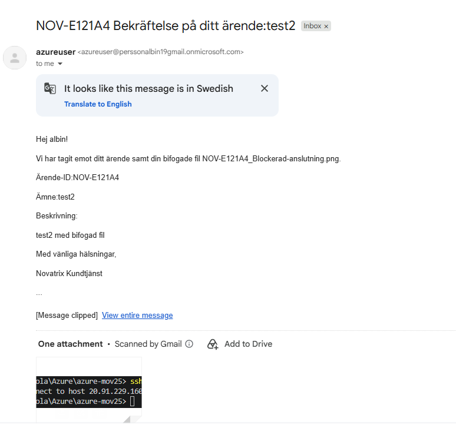

**Körning av flödet med bifogad fil:**
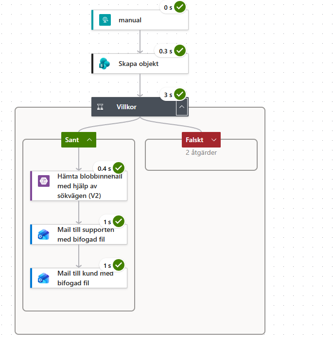

**Körning av flödet utan bifogad fil:**
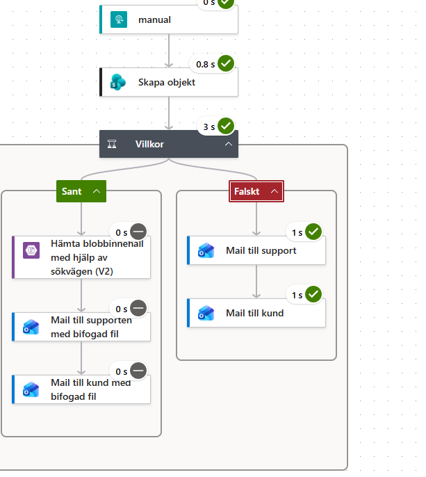

**Sharepoint lista**
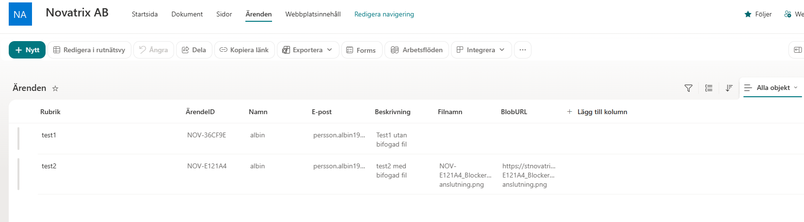

**Container:**
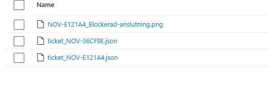

**Formulär**
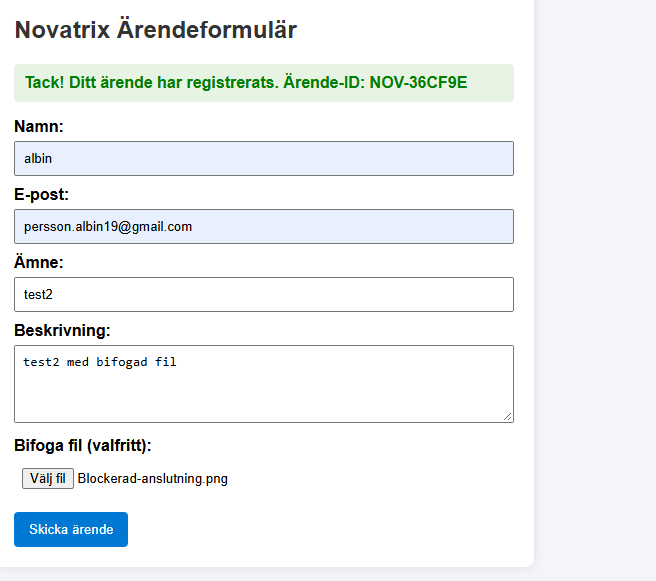

---

## Utmaning för Väl godkänt (VG)

### Integrationskedja över flera tjänster
Flödet integrerar tre separata plattformar i en sammanhängande kedja:
1. **Azure Blob Storage:** Binär- och metadatalagring (konto `stnovatrixmov25albin`, container `tickets`).
2. **SharePoint Online:** Centralt ärenderegister för uppföljning och statushantering.
3. **Office 365 Outlook:** Automatiska mejlutskick till interna och externa parter.

### Designmotivering
* **Lös dockning (Loose Coupling):** Flask-applikationen på Azure VM behöver ingen kännedom om SharePoint-strukturer eller e-postmottagare. Kommunikationen sker via ett rent REST/JSON-gränssnitt över HTTP POST, vilket gör systemdelarna helt oberoende av varandra.
* **Dataskydd & Resiliens:** Varje ärende sparas som en `.json`-fil i Azure Blob Storage utöver SharePoint-registreringen. Om M365-flödet drabbas av ett tillfälligt avbrott finns all originaldata kvar i Azure.
* **Exakt Namngivningsmatchning:** Genom att använda exakt samma svenska fältnamn i Flask-koden (`ArendeID`, `Epost`, `Amne`, `Beskrivning`, `Filnamn`, `BlobURL`) som i Power Automate-schemat minimeras risken för fel i datamappningen hela vägen till SharePoint.

### Framtida utökningar

1. Asynkron meddelandekö (Azure Service Bus / Storage Queue)
   * Problem: Om Power Automate ligger nere eller drabbas av ett tillfälligt avbrott kan HTTP POST-anropet från Flask misslyckas.
   * Lösning: Flask-appen lägger ärendet i en Azure Service Bus-kö. Power Automate (eller en Azure Function) läser från kön asynkront. Detta garanterar att inga ärenden går förlorade oavsett belastning eller avbrott i M365.

2. Centraliserad hemlighetshantering (Azure Key Vault & Managed Identity)
   * Lösning: Flytta `POWER_AUTOMATE_URL` och lagringsuppgifter till Azure Key Vault istället för att hålla dem i källkoden eller cloud-init. Applikationen hämtar hemligheterna säkert vid start med hjälp av VM:ens User-Assigned Managed Identity.

3. Migrering från IaaS till PaaS (Azure App Service / Azure Functions)
   * Lösning: Ersätt Linux-VM:en (IaaS) med en serverlös Azure Function eller Azure App Service (PaaS). Det eliminerar behovet av OS-patchning, Nginx-konfiguration och systemd-tjänster samtidigt som det sänker driftkostnaderna avsevärt.

4. Visualisering och SLA-analys (Power BI)
   * Lösning: Koppla SharePoint-listan till en Power BI-instrumentpanel för att följa upp nyckeltal (KPI:er) som:
     - Antal inkomna ärenden per dag/vecka.
     - Genomsnittlig hanteringstid.
     - Andel ärenden med bilagor.

5. Automatisk SLA-eskalering
   * Lösning: Ett schemalagt Power Automate-flöde som körs en gång i timmen och söker i SharePoint-listan efter ärenden som varit öppna i mer än 24 timmar utan åtgärd, och automatiskt skickar eskaleringsnotiser till supportchefen via Teams.

6. Kundkommunikation via SMS (Azure Communication Services)
   * Lösning: Utöka Power Automate-flödet med ett steg som skickar ett automatiskt SMS till kunden med bekräftelse och länk till statusuppdatering när ärendet registreras eller stängs.

7. Identitet och Accesshantering (Microsoft Entra ID / SSO)
   * Lösning: Om formuläret ska användas internt av Novatrix anställda kan Flask-appen skyddas med Microsoft Entra ID (SSO). Då hämtas namn och e-post adress automatiskt från den inloggade M365-profilen.