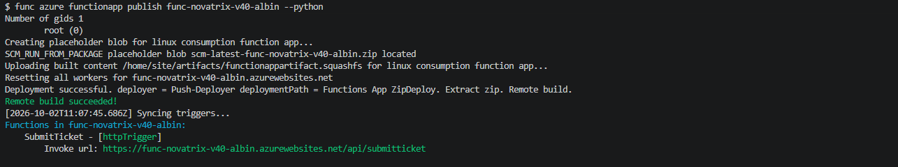
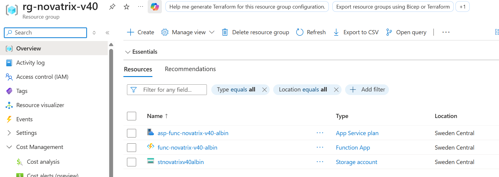
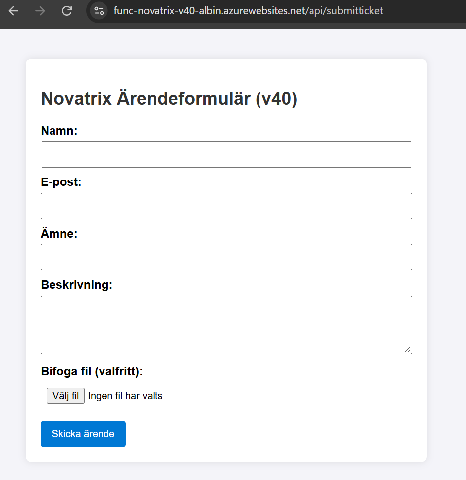
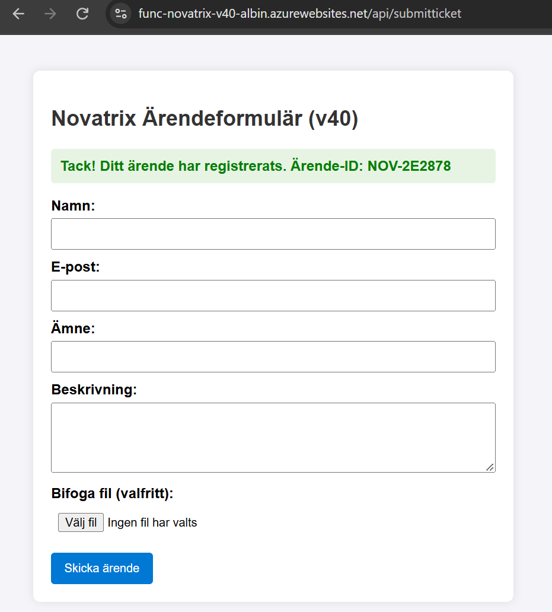
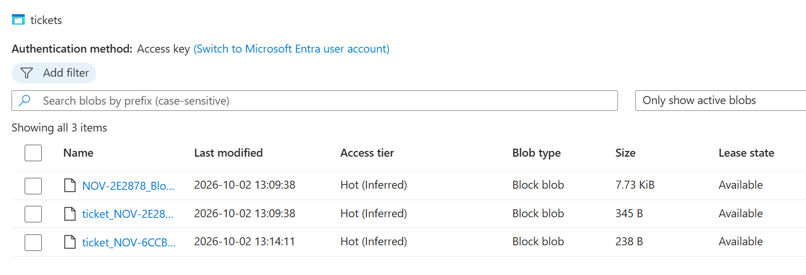
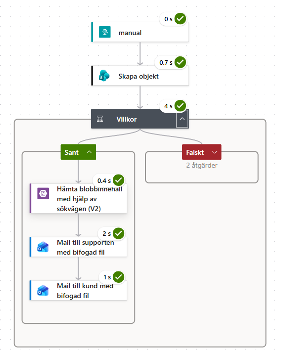
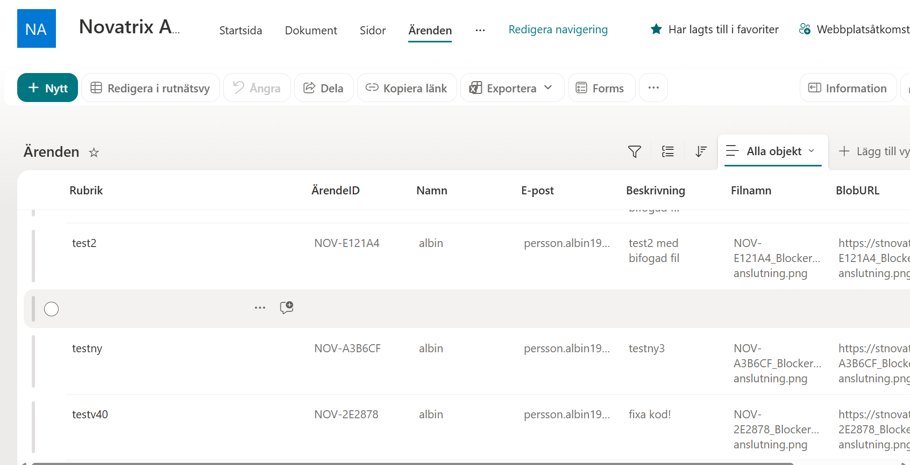
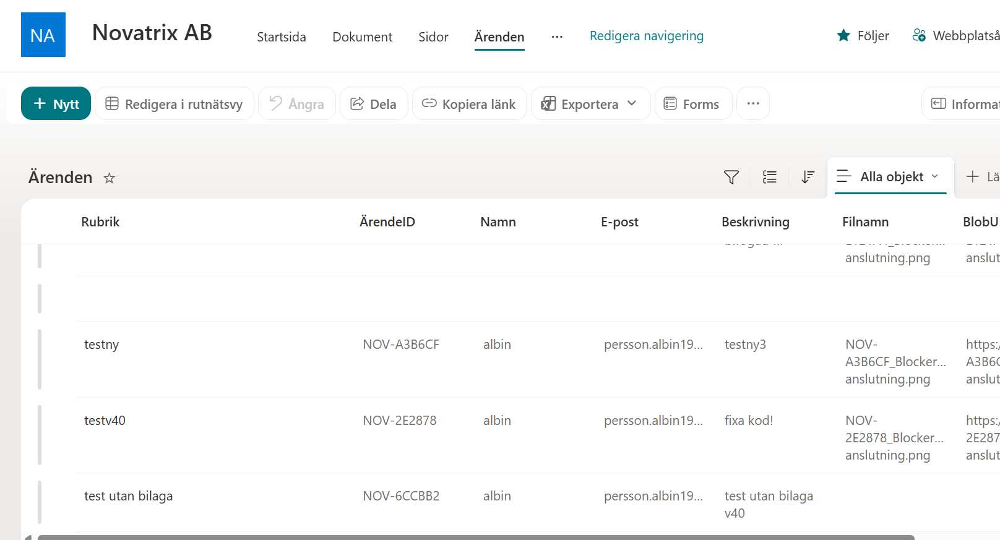

# Azure – Uppgift 7 (v40)

**Namn:** Albin Persson  
**Kurs:** Azure v.40

## Delmoment 1, Repo

Detta repository innehåller infrastrukturen som kod (IaC) samt källkoden för den serverless-baserade ärendemottagningen.

### Mappstruktur för v40
```text
v40/
├── function_app.py                      # Python-kod för Azure Function (GET/POST, Blob & Webhook)
├── host.json                            # Konfigurationsfil för Azure Functions runtime
├── requirements.txt                     # Python-beroenden (azure-functions, azure-storage-blob)
├── azuredeploy-v40.json                 # ARM-mall (IaC) för Linux Function App & Storage Account
├── azuredeploy-v40.parameters.json       # Offentlig parameterfil för ARM-mallen
└── .gitignore                           # Exkluderar lokala hemligheter och virtuella miljöer
```

---

## Delmoment 2, Kör på en alternativ nivå (Serverless)

Ärendemottagningen har implementerats som en händelsestyrd **Azure Function** i Python 3.11 på en Linux-baserad **Consumption Plan (Y1)**.

### Funktionens arbetsflöde
1. **HTTP GET (`/api/SubmitTicket`):** Returnerar det publika HTML-formuläret där kunden kan fylla i ärendeuppgifter och bifoga en fil.
2. **HTTP POST (`/api/SubmitTicket`):**
   * Genererar ett unikt ärende-ID (t.ex. `NOV-A1B2C3`) samt tidsstämpel.
   * Laddar upp bifogad fil till Azure Blob Storage (container `tickets`).
   * Skapar en JSON-fil (`ticket_NOV-XXXXXX.json`) med allt ärendedata och sparar i Blob Storage.
   * Triggat ett externt flöde i **Power Automate** via en HTTP Webhook för vidare bearbetning (SharePoint-registrering och mejlutskick med bilaga).
   * Returnerar en bekräftelsesida till användaren med unikt ärendenummer.

---

## Delmoment 3, Jämför nivåerna (VM, Containers och Serverless)

För att utvärdera Novatrix arkitektur har tre virtualiseringsnivåer analyserats:

| Egenskap | Virtuell Maskin (VM) | Containers (Docker / ACA) | Serverless (Azure Functions) |
| :--- | :--- | :--- | :--- |
| **Abstraktionsnivå** | Hårdvara & Operativsystem | Applikation & Miljöberoenden | Enskild funktion / Kodsnutt (*Event-driven*) |
| **Driftsansvar** | **Högst:** OS-patchar, säkerhet och webbserverkonfiguration (t.ex. Nginx). | **Mellan:** Hantering av container-images, Dockerfiles och runtime-versioner. | **Lägst:** Microsoft hanterar OS, exekveringsmiljö och underliggande infrastruktur. |
| **Skalbarhet** | Långsam (tar minuter att starta/skala upp nya maskiner). | Snabb (sekunder att starta nya containerinstanser). | Omedelbar och automatisk per inkommande HTTP-anrop. |
| **Kostnadsmodell** | Fast pris per timme/månad oavsett nyttjandegrad (dyrt i vila). | Betalning för tilldelad CPU/RAM när containern körs. | **Pay-per-use:** Betalning enbart för exekveringstid i millisekunder. |

### Analys av nivåerna för Novatrix ärendemottagning
* **VM:** Onödigt tungt och dyrt. En hel webbserver står igång 24/7 för en komponent som bara används sporadiskt.
* **Containers:** Ett utmärkt val om applikationen har komplexa systemberoenden eller behöver flyttas mellan olika molnleverantörer (*multi-cloud*), men medför extra administration av container-images och byggrutiner.
* **Serverless:** **Det optimala valet.** Ärendemottagningen är genuint händelsestyrd – koden körs enbart när någon skickar ett formulär, exekverar på några sekunder och förbrukar noll resurser i vila.

---

## Delmoment 4, Verifiera och dokumentera

Lösningen har verifierats genom hela flödet. Följande moment har bekräftats med skärmdumpar:

1. **Deployment:** Lyckad publicering via Azure CLI och Azure Functions Core Tools (`func azure functionapp publish`).



2. **Formulär:** Åtkomst till formuläret och generering av unikt ärende-ID vid inskick.



3. **Blob Storage:** Verifiering av lagrad `.json`-datafil och bifogad fil i containern `tickets`.


4. **Power Automate:** Bekräftad köraktivitet (*Succeeded*) i flödeshistoriken.

**Med bifogad fil**


**Utan bifogad fil**


5. **Integrationer:** Registrering i SharePoint-listan samt mottaget mejl i Outlook med bifogad fil.

---

## Utmaning för väl godkänt

## Utmaning för VG: Motivering, Ekonomi, IaC & Optimering

### 1. Motivering utifrån Novatrix behov
Novatrix kundtjänst har en utpräglad händelsestyrd trafikprofil (*event-driven*). Inkommande ärenden skickas in sporadiskt under dygnet med mindre spikar under kontorstid och nästan obefintlig aktivitet under nätter och helger. Serverless är det mest välgrundade valet för denna arbetsbelastning eftersom systemet är helt passivt tills en kund faktiskt behöver använda formuläret.

### 2. Trafikvolym, nyttjandegrad och hantering av besökskostnad
Formuläret används endast när en kund aktivt behöver support, vilket innebär att tjänsten står oanvänd under största delen av dygnet.

* **Varför VM och Containers inte går att motivera:**
  Om Novatrix hade behållit sin dedikerade VM eller kört lösningen i en ständig container-instans (t.ex. Azure Container Instances med fast tilldelning), hade företaget tvingats betala för beräkningskapacitet 24 timmar om dygnet, 365 dagar om året – oavsett om 0 eller 100 kunder skickar ärenden. Det ger en mycket låg resurseffektivitet och en onödig fast månadskostnad för en tjänst med så låg nyttjandegrad.
* **Analys av sidvisningar (GET-anrop) vs Rörliga kostnader:**
  Ett potentiellt motargument mot Serverless är att även vanliga sidvisningar (HTTP GET för att hämta HTML-formuläret) räknas som en exekvering av koden och därmed genererar anrop. I Novatrix fall väger Serverless ändå tyngst av två anledningar:
  1. *Generös fri kvot:* Azure Functions erbjuder 1 miljon fria exekveringar per månad på Consumption Plan. För en kundtjänst med låg till måttlig trafik blir den faktiska kostnaden för både sidvisningar och inskickade ärenden fortfarande **0 kr**.
  2. *Snabb exekveringstid:* Att returnera en statisk HTML-sträng tar endast ett fåtal millisekunder i Python, vilket gör att även om frikvoten skulle överskridas kostar tusentals besök bara några enstaka ören – jämfört med en VM som kostar hundratals kronor i månaden i fast avgift.

### 3. Ekonomi och Skalbarhet
* **Kostnadseffektivitet:** På förbrukningsplanen (Y1 Dynamic) tillämpas ren *pay-per-use* där exekveringstiden mäts i millisekunder och minnesförbrukning i GB-sekunder.
* **Fri kvot:** Azure Functions inkluderar 1 miljon kostnadsfria exekveringar per månad, vilket täcker Novatrix hela förbrukning vid normala volymer.
* **Automatisk skalning:** Om en marknadsföringskampanj eller driftstörning skulle orsaka en plötslig storm av supportärenden skalar Azure Functions automatiskt upp antalet parallella instanser för att hantera alla anrop utan manuell konfiguration eller prestandaförlust.

### 4. Provisionering som kod (IaC), Automation & Aktivering
Både infrastrukturen i Azure och integrationsflödet i Power Automate är helt deklarerade som kod och konfiguration för maximal reproducerbarhet.

* **Säkerhetsseparering:** Känsliga parametrar (t.ex. Webhook-URL till Power Automate) separeras till lokala parameterfiler (`azuredeploy-v40.parameters.local.json`) som ignoreras av Git via `.gitignore`.
* **Källkod och Flödesdefinition:**
  * `azuredeploy-v40.json`: ARM-mall för automatiskt skapande av Storage Account, Linux App Service Plan och Function App.
  * `V39/definitions.json`: Exporterad flödesdefinition (JSON) för Power Automate. Gör att integrationsflödet för SharePoint och e-postutskick enkelt kan importeras och återskapas i valfri miljö.

#### Korrekt ordningsföljd för att återskapa och aktivera hela lösningen:

1. **Skapa/importera Power Automate-flödet:**
   Importera flödesdefinitionen `V39/definitions.json` i Power Automate / Logic Apps och koppla SharePoint-listan samt din e-postanslutning. När flödet sparas genereras en unik HTTP Webhook-URL.

2. **Konfigurera parameterfilen med Webhook-URL:**
   Kopiera den genererade Webhook-URL:en från Power Automate och klistra in den i din lokala, skyddade parameterfil `azuredeploy-v40.parameters.local.json` under parametern `powerAutomateUrl`.

3. **Provisionera infrastrukturen i Azure (CLI):**
   Kör ARM-mallen via Azure CLI. Miljövariabeln `POWER_AUTOMATE_URL` skapas då automatiskt i Function Appens App Settings utifrån parameterfilen:
   ```bash
   az deployment group create \
     --resource-group rg-novatrix-v40 \
     --template-file azuredeploy-v40.json \
     --parameters azuredeploy-v40.parameters.local.json
   ```

4. **Publicera källkoden och aktivera Function Appen:**
   Navigera till projektmappen och publicera Python-koden med `--python`-flaggan för att aktivera funktionen:
   ```bash
   cd v40
   func azure functionapp publish func-novatrix-v40-albin --python
   ```

### 5. Framtida optimeringar för lösningen
1. **Separering av Frontend och Backend (Kostnadsoptimering):**  
   I denna initiala version hanterar Azure Function både gränssnittet (GET) och logiken (POST) för att hålla applikationen samlad i en fil. För att helt eliminera Function-exekveringar vid rena sidvisningar skulle frontend-formuläret (HTML/CSS/JS) i framtiden kunna flyttas till **Azure Static Web Apps** eller en **Static Website i Azure Blob Storage** (vilket kostar några ören per månad). Då anropas Azure Function *endast* vid POST-anrop när ett ärende faktiskt skickas in.
2. **Managed Identity (Säkerhet utan extra kostnad):**  
   Ersätta den statiska lagringsnyckeln till Blob Storage med en *User-Assigned Managed Identity* och RBAC-behörigheten *Storage Blob Data Contributor*. Detta eliminera lagrade anslutningssträngar helt i koden/miljövariablerna, utan att medföra någon extra licens- eller driftskostnad.
3. **Azure Key Vault (Säkerhet):**  
   Flytta den känsliga `POWER_AUTOMATE_URL` till Azure Key Vault och referera den direkt via Key Vault References i ARM-mallen för att undvika att ha URL:en i klartext i App Settings.
4. **API Management / APIM (Säkerhet & Prestanda):**  
   Placera en API Gateway framför Azure Function för att införa Rate Limiting (skydd mot DoS-attacker), IP-filtrering och WAF (Web Application Firewall).  
   *Kostnadsövervägande:* Då APIM medför en extra avgift per miljon anrop (även i Consumption Tier) väljs detta bort i dagsläget för att inte påföra Novatrix onödiga löpande kostnader innan trafikvolymen eller säkerhetskraven motiverar det.