# Azure – Uppgift 8 (v41), Slutuppgift

**Namn:** Albin Persson  
**Kurs:** Microsoft Azure v.41  
**Företag:** Nordvik Fastigheter AB  
**GitHub-repo:** https://github.com/02albper-frog/azure-mov25


---

## Sammanfattning

Nordvik Fastigheter AB har fått en hyresgästportal i Azure. Hyresgästen loggar in, skickar en felanmälan (rubrik, beskrivning, fastighet, lägenhet, kategori och en obligatorisk bild) och kan se status på sina egna ärenden. Förvaltare tar emot ärendena i en SharePoint-lista och får ett mejl för varje anmälan, med bilden bifogad. Akuta kategorier (värme, vatten, lås) får ett eget akutmejl. Ekonomi har läsande insyn.

Hela miljön byggs upp från noll med en ARM-mall och ett skript.

### Arkitektur

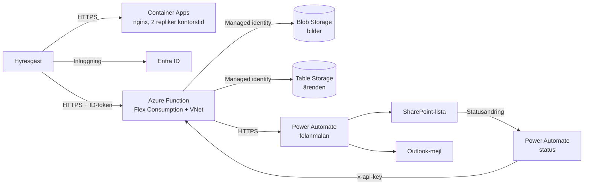

### Vad som händer när en hyresgäst skickar en anmälan

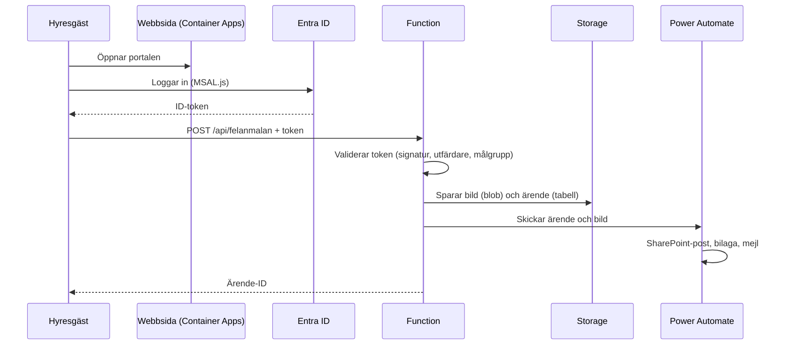


### Mappstruktur för v41

```text
V41/
├── deploy-v41.sh                                  # Bygger upp hela miljön från noll
├── README.md                                      # Den här dokumentationen
├── .gitignore                                     # Exkluderar hemligheter och lokala filer
├── arm/
│   ├── azuredeploy-nordvik.json                   # ARM-mall (IaC) för hela Azure-miljön
│   ├── azuredeploy-nordvik.parameters.json # Exempel på parameterfil (utan hemligheter)
│   └── azuredeploy-nordvik.parameters.local.json  # Riktig parameterfil (ignoreras av Git)
├── backend/
│   ├── function_app.py                            # Python-kod för Azure Function
│   ├── host.json                                  # Konfiguration för Functions runtime
│   └── requirements.txt                           # Python-beroenden
├── frontend/
│   ├── index.html                                 # Portalen (inbäddas i ARM-mallen vid driftsättning)
│   └── dockerfile                                 # Används inte i driftsättningen, se Del A
└── m365/
    ├── setup-users-groups.sh                      # Skapar grupper och användare i Entra ID
    ├── definitions.json                           # Exporterat flöde: felanmälan
    └── definitions-status.json                    # Exporterat flöde: statusuppdatering
```


---

## Del A, Dokumentation

### Centrala Azure-tjänster i lösningen

**Compute**

| Tjänst | Används till | Varför |
| :--- | :--- | :--- |
| Azure Functions (Flex Consumption) | Backend: tar emot anmälningar, validerar inloggning, sparar data | Serverless, betalar bara när koden körs, kan ligga i VNet |
| Azure Container Apps (Consumption) | Frontend: serverar webbsidan | Container med `https` och automatisk skalning, flera repliker |

**Nätverk**

| Tjänst | Används till |
| :--- | :--- |
| Virtual Network (`vnet-nordvik`) | Privat nätverk, ett undernät för function appen (`snet-nordvik-func`, 10.0.3.0/24) |
| Network Security Group (`nsg-nordvik`) | Brandväggsregler för utgående trafik från function-undernätet |
| Tjänsteslutpunkt (service endpoint) mot Storage | Gör att lagringen kan släppa in trafik från undernätet |
| VNet-integration | Kopplar function appen till undernätet |
| Ingress med HTTPS (Container Apps) | Publik, krypterad adress till portalen |

**Storage**

| Tjänst | Används till |
| :--- | :--- |
| Storage account, datakonto (`stnordvik02albper01`) | Bilder (Blob), ärenden (Table) och förberedd container för dokument |
| Storage account, driftkonto (`stnordvikfn02albper01`) | Function appens egen drift och driftsättningspaket |
| Blob-containrar | `felanmalningar` (bilder), `dokument` (kontrakt och protokoll, förberedd) |
| Table Storage | Ärendena, med hyresgästens ID som nyckel |
| Livscykelregel | Flyttar blobbar till nivån Cool efter 90 dagar |
| Redundans | Datakontot använder zonredundant lagring (ZRS) |

### Virtualiseringsnivåerna

| Egenskap | Virtuell maskin (VM) | Containers | Serverless |
| :--- | :--- | :--- | :--- |
| **Abstraktionsnivå** | Hårdvara och operativsystem | Applikation och beroenden | Enskild funktion, händelsestyrd |
| **Driftsansvar** | Högst: patchar, säkerhet, webbserver | Mellan: images och runtime | Lägst: Microsoft sköter plattformen |
| **Skalbarhet** | Långsam, minuter | Snabb, sekunder | Automatisk per anrop |
| **Kostnadsmodell** | Fast pris per timme oavsett användning | Betalning för tilldelade resurser (Container Apps efter förbrukning) | Betalning efter körning |
| **Passar när** | Särskilda OS-krav eller äldre system | Egna beroenden, portabilitet | Händelsestyrd last med stora variationer |

### Vilken nivå jag valt för Nordviks portal och varför

**Backend: serverless (Azure Functions, Flex Consumption).** Anmälningarna är mycket ojämnt fördelade: i snitt cirka 70 per dygn, men en vattenläcka eller ett strömavbrott kan ge över 300 på en timme, och nära noll trafik nattetid. Serverless skalar upp automatiskt vid topparna och kostar nästan inget när ingen använder tjänsten. Det uppfyller kravet att Nordvik inte vill betala för kapacitet som står oanvänd nattetid. Flex Consumption valdes, och inte den vanliga Consumption-planen, eftersom den vanliga planen inte kan kopplas till ett virtuellt nätverk, vilket behövs för att kunna stänga lagringens brandvägg.

**Frontend: container (Azure Container Apps).** Webbsidan körs som en nginx-container med flera repliker (två under kontorstid), vilket gör att en enskild instans kan falla bort utan att portalen går ner, och med automatisk skalning upp till fem repliker vid belastning. Container Apps ger `https` direkt, vilket också krävs för inloggningen mot Entra ID.

**Varför inte en VM:** En VM kostar dygnet runt oavsett belastning, kräver patchning och egen webbserverkonfiguration, och skalar långsamt. Det går emot både kostnadskravet och kravet på att snabbt kunna hantera toppar.

**Ärlig avvägning:** Sidan är en enda statisk HTML-fil, och för den räcker i princip en statisk webbplats (Azure Static Web Apps eller statisk hosting i Storage), som skulle vara billigare. Containern valdes för att ge flera repliker och en tydlig containernivå i designen, men en statisk webbplats är ett rimligt alternativ för produktion.

---

## Delmoment 1, Compute

Portalen består av två delar som provisioneras av ARM-mallen:

* **Frontend:** `ca-nordvik-web` i en Container Apps-miljö (`cae-nordvik`). Mallen kör den färdiga `nginx:alpine`-imagen och monterar `index.html` som en fil från mallen, så ingen egen image eller något Container Registry behövs. Adresser och inloggningsinställningar fylls i av mallen vid driftsättning.
* **Backend:** `func-nordvik-backend-02albper01`, en Python 3.11-funktion på en Flex Consumption-plan (`asp-nordvik-flex`), med tre adresser:

| Adress | Metod | Syfte |
| :--- | :--- | :--- |
| `/api/felanmalan` | POST | Tar emot en anmälan med bild (kräver inloggning) |
| `/api/mina-anmalningar` | GET | Returnerar den inloggades egna ärenden |
| `/api/uppdatera-status` | POST | Anropas av Power Automate när status ändras (kräver nyckel) |

### Verifiering

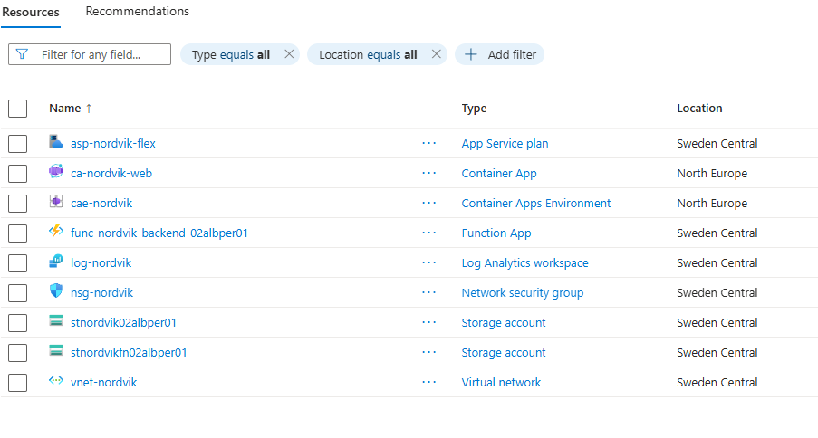
*Resursgruppen `rg-nordvik` med alla resurser och namn enligt mönstret typ-företag-syfte.*

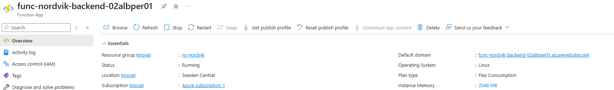
*Function appen körs i Sweden Central på Flex Consumption.*

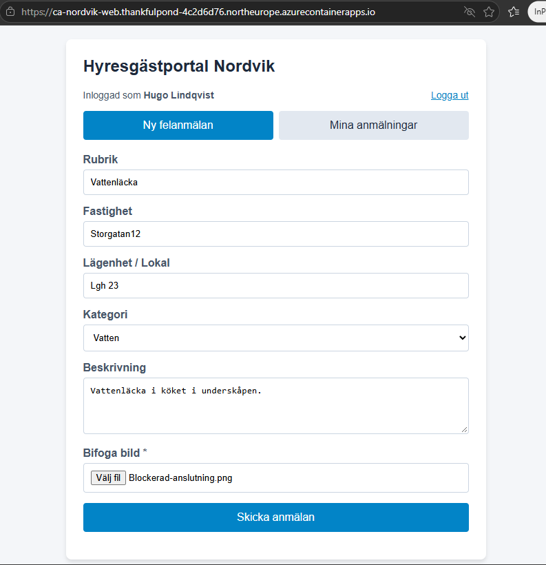
*Portalen över `https`, inloggad som hyresgäst, med obligatorisk bild.*

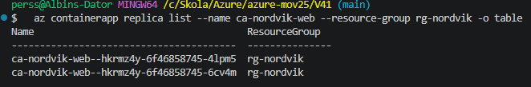

*Frontend kör i två repliker.*


---

## Delmoment 2, IAM

### Roller

| Roll | Åtkomst | Så styrs det |
| :--- | :--- | :--- |
| **Hyresgäst** | Skapar och ser bara sina egna ärenden | Inloggning mot Entra ID. Funktionen validerar token och filtrerar alltid på den inloggades eget ID |
| **Förvaltare** (`grp-nordvik-forvaltare`) | Hanterar ärendena | Redigeringsrätt i SharePoint-listan, *Storage Blob Data Contributor* på datakontot |
| **Ekonomi** (`grp-nordvik-ekonomi`) | Läsande insyn | *Reader* på resursgruppen, *Storage Blob Data Reader* på datakontot |
| **Portalen** (function appens hanterade identitet) | Når lagringen utan nycklar | *Storage Blob Data Contributor* och *Storage Table Data Contributor* på datakontot |

Användare och grupper skapas av `m365/setup-users-groups.sh` (tio personalanvändare och två test hyresgäster, uppdelade i grupperna `grp-nordvik-forvaltare`, `grp-nordvik-ekonomi` och `grp-nordvik-hyresgast`). Rolltilldelningarna ligger i ARM-mallen och skapas utifrån gruppernas objekt-ID, som skriptet hämtar vid deploy.

### Least privilege för hyresgäster

Azure RBAC kan inte skilja en användare från en annan inom samma tabell, så kontrollen sitter i funktionen. Den kontrollerar signatur, utfärdare, målgrupp och giltighetstid på token, och hämtar bara rader där tabellens partitionsnyckel är den inloggades eget ID. Klienten kan inte påverka vilket ID som används.

```python
def _validate_token(req):
    ...
    key = _jwk_client.get_signing_key_from_jwt(token).key
    return jwt.decode(
        token, key, algorithms=["RS256"], audience=client,
        issuer=f"https://login.microsoftonline.com/{tenant}/v2.0",
    )

# I /api/mina-anmalningar:
rows = _table().query_entities(query_filter="PartitionKey eq @oid", parameters={"oid": oid})
```

### Verifiering


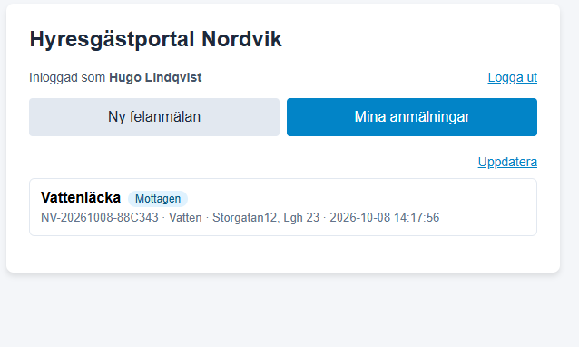
*Hugo skickar en anmälan och ser den under Mina anmälningar.*

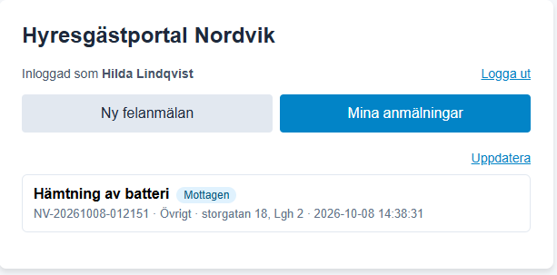
*Hilda ser bara sitt eget ärende, trots att SharePoint-listan har två ärenden.*

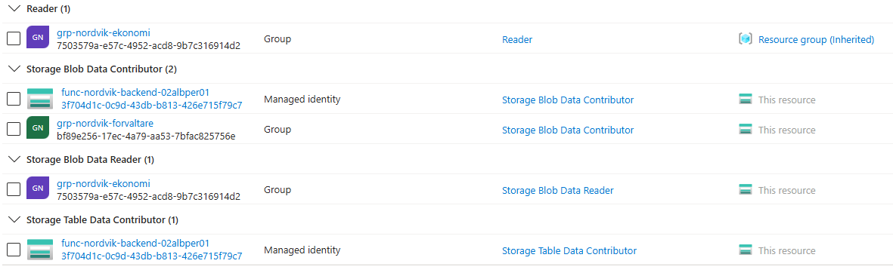
*Rolltilldelningarna på datakontot: ekonomi läser, förvaltare och funktionens identitet skriver.*


---

## Delmoment 3, Nätverk och säkerhet

Portalen är publikt nåbar, medan lagringen av anmälningar och bilder ligger skyddad. Skyddet bygger på flera lager (defense in depth):

| Lager | Åtgärd |
| :--- | :--- |
| **Transport** | `https` överallt, TLS 1.2 som lägsta version, HTTP omdirigeras till Container Apps (`allowInsecure: false`) |
| **Identitet** | Inloggning mot Entra ID, funktionen validerar token. Statusadressen skyddas med en delad nyckel som jämförs i konstant tid |
| **Webbläsare** | CORS i function appen släpper bara in webbplatsens egen `https`-adress |
| **Nätverk** | Function appen ligger i `snet-nordvik-func` via VNet-integration |
| **Brandvägg, utgående** | NSG tillåter bara DNS, Storage, Entra ID och HTTPS mot internet. All övrig utgående trafik nekas |
| **Brandvägg, lagring** | Standardåtgärden är `Deny`. Bara function-undernätet (via tjänsteslutpunkt) och administratörens IP släpps in |
| **Åtkomst till lagring** | Nyckelåtkomst avstängd (`allowSharedKeyAccess: false`), publik blob-åtkomst avstängd, bara Entra-identiteter med roll kommer åt datan |
| **Behörighet** | Minsta behörighet per roll, hanterad identitet i stället för lösenord |

### NSG-regler

| Namn | Prioritet | Riktning | Åtgärd | Mål |
| :--- | :--- | :--- | :--- | :--- |
| allow-out-dns | 100 | Utgående | Tillåt | 168.63.129.16, port 53 |
| allow-out-storage | 110 | Utgående | Tillåt | Tjänsttagg `Storage`, port 443 |
| allow-out-entra | 120 | Utgående | Tillåt | Tjänsttagg `AzureActiveDirectory`, port 443 |
| allow-out-https | 130 | Utgående | Tillåt | `Internet`, port 443 (Power Automate) |
| deny-out-all | 4000 | Utgående | Neka | Allt övrigt |

### Verifiering

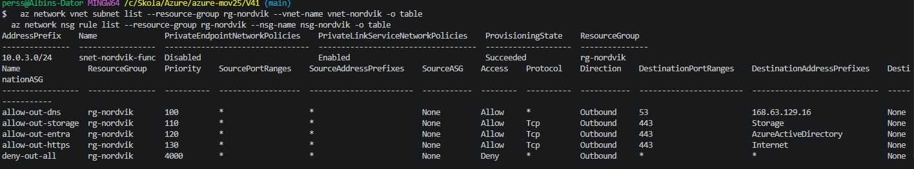
*Undernätet och NSG-reglerna.*

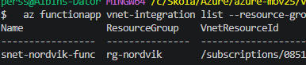
*Function appen är VNet-integrerad i `snet-nordvik-func`.*

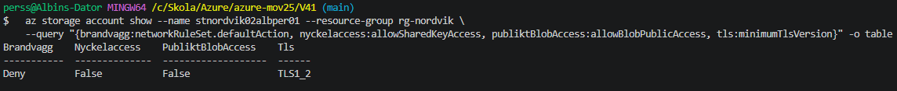
*Lagringens brandvägg (`Deny`), avstängd nyckelåtkomst, avstängd publik åtkomst och TLS 1.2.*


### Avgränsningar i nätverket

* **Frontend ligger utanför VNet.** Container Apps-miljön är inte kopplad till det egna nätverket. Den serverar bara en HTML-fil och hanterar varken personuppgifter eller lagring, så den behöver inte ligga bakom nätverkslagret.
* **Frontend ligger i en annan region.** Container Apps-miljön hamnar i North Europe, eftersom Sweden Central saknade ledig kapacitet vid driftsättningen (`ManagedEnvironmentNoAvailableCapacityInRegion`). Övriga resurser ligger i Sweden Central. Regionen är en parameter (`webbPlats`).
* **Inga privata slutpunkter.** Lagringen skyddas med tjänsteslutpunkt och brandvägg. Privata slutpunkter hade varit ett starkare lager, men kostar per slutpunkt och kräver en privat DNS-zon.
* **Function appens inkommande trafik är publik.** Den måste kunna nås av webbläsare. Skyddet ligger i inloggningen, CORS och nyckeln för statusadressen.
* Administratörens IP-adress släpps in genom lagringens brandvägg vid deploy, för att kunna felsöka. Den är en parameter (`klientIp`) och kan lämnas tom.

---

## Delmoment 4, Storage

| Resurs | Innehåll |
| :--- | :--- |
| `stnordvik02albper01` (datakonto, ZRS) | Container `felanmalningar` (bilder, namngivna efter ärende-ID), container `dokument` (förberedd för kontrakt och protokoll), tabell `felanmalningar` (ärendena) |
| `stnordvikfn02albper01` (driftkonto, LRS) | Function appens driftsättningspaket och host-data, åtkomst bara via identitet |

* **Bilder** laddas upp av funktionen med dess hanterade identitet. Containrarna är privata.
* **Ärenden** sparas i tabellen med hyresgästens ID som partitionsnyckel och ärende-ID som radnyckel, tillsammans med status, tidsstämpel och bildens filnamn.
* **Livscykelregel:** blockblobbar flyttas till nivån Cool 90 dagar efter senaste ändring. Det passar kontrakt och protokoll som sällan läses efter tre månader. Nivån Archive används inte, eftersom den inte stöds på konton med zonredundant lagring (ZRS), och eftersom filer i Archive tar timmar att återställa.
* **Dimensionering:** Nordviks uppgifter anger cirka 5 till 10 GB nya bilder per år och cirka 40 GB dokument. Det ryms med god marginal i ett vanligt Storage-konto.

### Verifiering

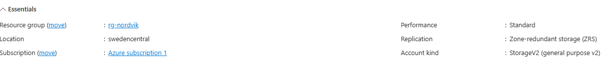
*Datakontot i Sweden Central med zonredundant lagring (ZRS).*

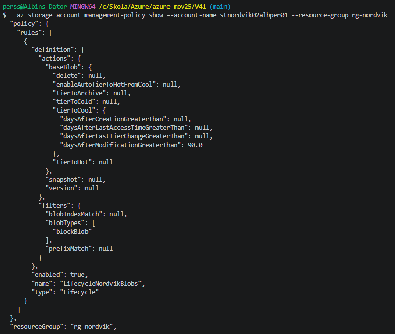
*Livscykelregeln: Cool efter 90 dagar.*


---

## Delmoment 5, IaC

Hela Azure-miljön är deklarerad i `arm/azuredeploy-nordvik.json` och byggs med `deploy-v41.sh`.

### Vad mallen skapar

Nätverkssäkerhetsgrupp, virtuellt nätverk med undernät, två Storage-konton med containrar, tabell och livscykelregel, Flex Consumption-plan och function app med hanterad identitet, Log Analytics-arbetsyta, Container Apps-miljö och app, samt alla rolltilldelningar. Alla resurser som går att tagga har taggarna `Company`, `Environment` och `CostCenter`.

### Parametrar

| Parameter | Syfte |
| :--- | :--- |
| `powerAutomateUrl` (hemlig) | Adressen till flödet som tar emot anmälningar |
| `statusNyckel` (hemlig) | Delad nyckel för `/api/uppdatera-status` |
| `entraClientId` | Klient-ID för app-registreringen (inloggning) |
| `entraTenantId` | Tenant (hämtas automatiskt från prenumerationen) |
| `namnSuffix`, `lopnummer` | Bygger de globalt unika namnen (storage, function app) |
| `environment` | Värde för taggen `Environment` |
| `storageSku` | `Standard_ZRS` (standard) eller `Standard_LRS` |
| `webbPlats` | Region för Container Apps |
| `forvaltareGruppId`, `ekonomiGruppId` | Gruppernas objekt-ID för rolltilldelningar (tomma hoppas över) |
| `klientIp` | Administratörens IP som släpps in genom lagringens brandvägg |

Med ett annat `lopnummer` och en annan resursgrupp går det att snabbt resa en likadan test- eller demomiljö bredvid produktionen, vilket Nordvik efterfrågar när beståndet växer.

### Exempel på parameterfil (`azuredeploy-nordvik.parameters.example.json`)

```json
{
  "$schema": "https://schema.management.azure.com/schemas/2019-04-01/deploymentParameters.json#",
  "contentVersion": "1.0.0.0",
  "parameters": {
    "powerAutomateUrl": { "value": "<URL från Power Automate-flödet>" },
    "statusNyckel": { "value": "<lång slumpmässig nyckel, skapa med: openssl rand -hex 24>" }
  }
}
```

Den riktiga filen (`azuredeploy-nordvik.parameters.local.json`) innehåller hemligheter och ignoreras av Git via `.gitignore`.

### Det som inte ligger i mallen

| Vad | Varför | Hur det görs |
| :--- | :--- | :--- |
| Resursgruppen | Mallen deployas in i en befintlig grupp | `az group create` i skriptet |
| App-registrering för inloggning | Hör till Entra ID, och adressen finns först efter deployen | `az ad app create` i skriptet, adressen läggs in efter deployen |
| Function-koden | ARM skapar en tom function app | `func azure functionapp publish` i skriptet |
| Power Automate-flöden och SharePoint-lista | Hör till Microsoft 365 | Byggs enligt avsnittet om delmoment 6 |
| Användare och grupper | Hör till Entra ID | `m365/setup-users-groups.sh` |

### Så återskapas hela lösningen

1. **Skapa användare och grupper:** kör `m365/setup-users-groups.sh`.
2. **Skapa SharePoint-listan och flödena** (se Delmoment 6). Kopiera adressen från flödet som tar emot anmälningar.
3. **Skapa parameterfilen** `arm/azuredeploy-nordvik.parameters.local.json` utifrån exemplet ovan.
4. **Kör skriptet från projektmappen:**

```bash
bash deploy-v41.sh
```

Skriptet gör sex saker i ordning: registrerar resursleverantörer, skapar resursgruppen, skapar app-registreringen, deployar ARM-mallen, lägger in webbadressen som tillåten inloggningsadress och publicerar function-koden (med nya försök om rolltilldelningarna inte har slagit igenom än). Kärnan:

```bash
az group create --name rg-nordvik --location swedencentral

az deployment group create \
  --resource-group rg-nordvik \
  --template-file arm/azuredeploy-nordvik.json \
  --parameters arm/azuredeploy-nordvik.parameters.local.json \
  --parameters namnSuffix=02albper lopnummer=01 entraClientId=<klient-id>

cd backend
func azure functionapp publish func-nordvik-backend-02albper01 --python
```

5. **Uppdatera statusflödet** med function-adressen och nyckeln om de har ändrats.

### Verifiering

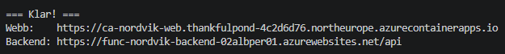
*Skriptet gick igenom och skrev ut adresserna till portalen och backend.*

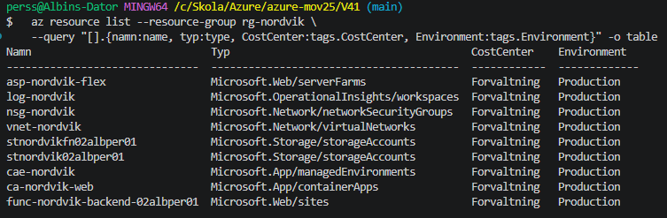
*Alla resurser har taggarna `CostCenter` och `Environment`.*


---

## Delmoment 6, Automation och integration

Två flöden i Power Automate kopplar ihop Azure med Nordviks Microsoft 365.

### Flöde 1: Felanmälan

Utlösare: *När en HTTP-begäran tas emot* (anropas av funktionen).

| Steg | Åtgärd |
| :--- | :--- |
| 1 | **Svar** direkt med status 200, så att funktionen inte väntar på resten |
| 2 | **Skapa objekt** i SharePoint-listan *Nordvik Felanmälningar* |
| 3 | **Lägg till bifogad fil**: bilden (som funktionen skickar med som base64) läggs på ärendet |
| 4 | **Villkor** (Eller): kategori är Värme, Vatten eller Lås |
| 5a | Sant: akutmejl via Outlook, ämne börjar med *Akut felanmälan*, bilden bifogad |
| 5b | Falskt: vanligt mejl via Outlook, bilden bifogad |

Anropet från funktionen innehåller:

```json
{
  "arendeId": "NV-20261008-012151",
  "rubrik": "...", "beskrivning": "...", "fastighet": "...", "lagenhet": "...",
  "kategori": "Övrigt", "epost": "...", "inskickadAv": "...",
  "bildFilnamn": "NV-20261008-012151.png",
  "bildInnehall": "<base64>",
  "blobPath": "/felanmalningar/NV-20261008-012151.png"
}
```

SharePoint-listan har kolumnerna Rubrik, Beskrivning, Fastighet, Lagenhet, Kategori (val), BildUrl (sökvägen till originalbilden i Blob Storage), Status (val: *Mottagen*, *Under behandling*, *Åtgärdad*) och ÄrendeID.

### Flöde 2: Statusuppdatering

Utlösare: *När ett objekt skapas eller ändras* i SharePoint-listan. Flödet anropar `POST /api/uppdatera-status` med ärende-ID och ny status, och nyckeln i rubriken `x-api-key`. Funktionen uppdaterar raden i tabellen, och hyresgästen ser den nya statusen (som en färgad etikett) nästa gång fliken *Mina anmälningar* öppnas eller **Uppdatera** trycks.

### Händelsekedjan

Anmälan går genom flera tjänster: webbläsare, Container Apps, Entra ID, Azure Functions, Blob och Table Storage, Power Automate, SharePoint och Outlook. Ändrar en förvaltare status går kedjan åt andra hållet: SharePoint, Power Automate, funktionen, Table Storage och portalen.

### Verifiering

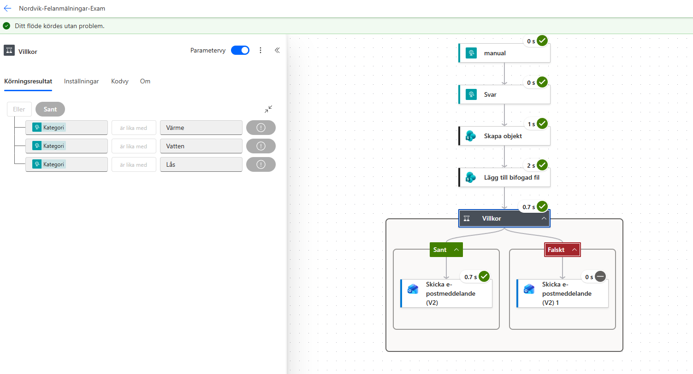
*Körning för kategorin Vatten: villkoret väljer Sant och alla steg är gröna.*

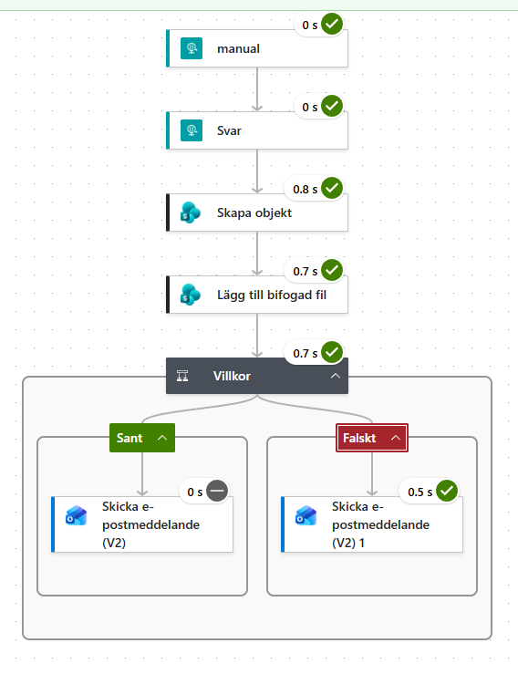
*Körning för kategorin Övrigt: villkoret väljer Falskt.*

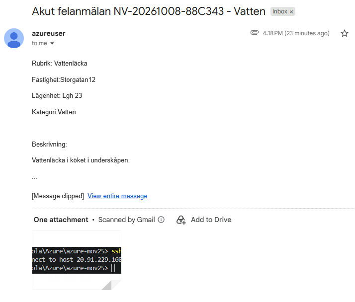
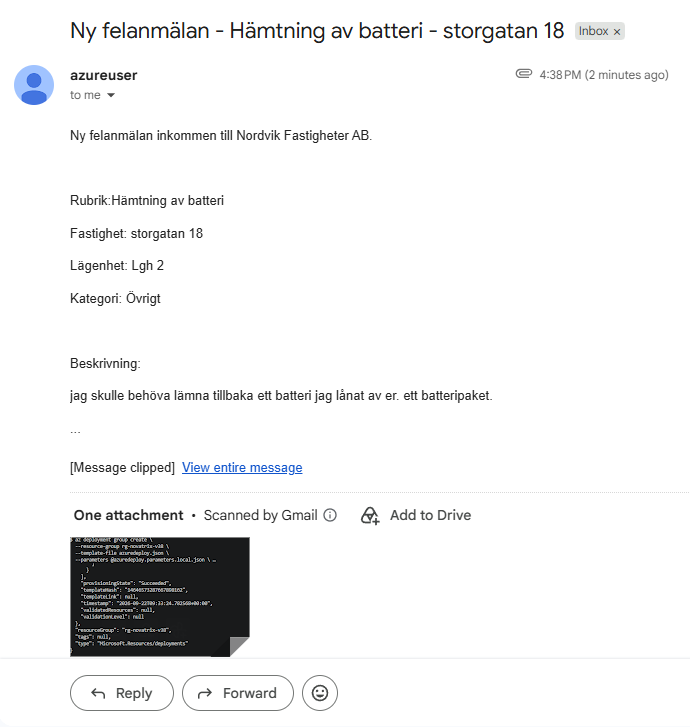
*Akutmejl och vanligt mejl, med bilden bifogad.*

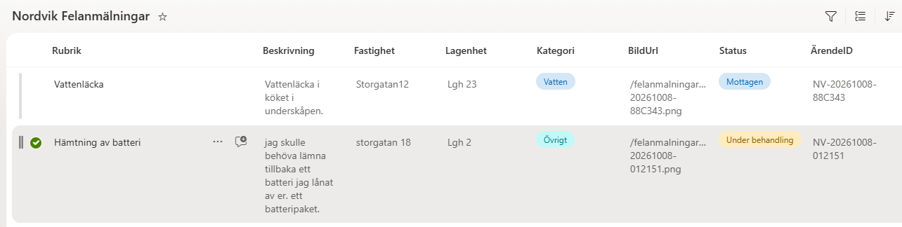
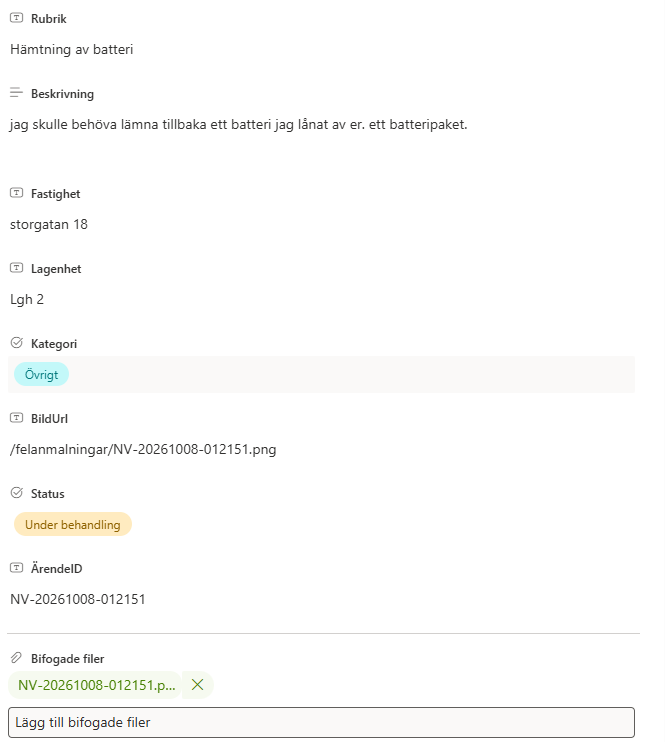
*Ärendena i listan, och ett objekt med bilagan.*

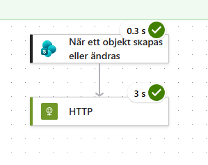
*Statusflödet körs utan fel.*


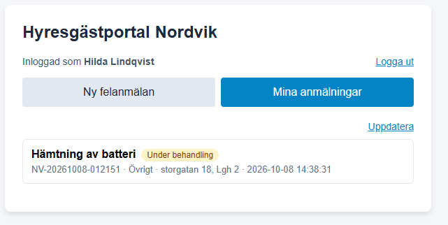
*Hilda ser Mottagen innan förvaltaren ändrar, och Under behandling efteråt.*


### Avgränsningar i automationen

* Mottagaren av mejlen är fast i flödet. En riktig lösning skulle slå upp ansvarig förvaltare per fastighet.
* Notisen till förvaltaren skickas som e-post via Outlook. Teams-notis ingår inte.
* HTTP-utlösare och HTTP-åtgärd i Power Automate räknas som premium-kopplingar och kräver normalt en särskild licens, vilket inte är kontrollerat för Nordviks verksamhet.
* Statusen uppdateras när sidan läses om, och inte live. Det är ett medvetet val för att hålla kostnaden nere, eftersom automatisk omläsning ger fler anrop.

---

## Krav från verksamheten och hur lösningen möter dem

| Krav | Hur lösningen möter det | Status |
| :--- | :--- | :--- |
| Ojämn last, upp mot 120 samtidiga användare | Container Apps skalar upp till fem repliker (en replik per 50 samtidiga anrop), Functions skalar automatiskt (upp till 40 instanser) | Konfigurerat, ej lasttestat |
| Över 300 anmälningar på en timme | Serverless-backend skalar efter belastning | Konfigurerat, ej lasttestat |
| Tåla att en instans faller bort | Minst två repliker av frontend under kontorstid, zonredundant datalagring | Två repliker verifierade |
| Inte betala för kapacitet nattetid | Frontend kan skalas ner till noll nattetid, Functions betalas efter körning | Se kommentaren under Delmoment 1 |
| Cirka 2 500 kr per månad | Betalning efter förbrukning, ingen virtuell maskin | ca 450 kr |
| Lagringen får inte vara publik, åtkomst per roll | Brandvägg `Deny`, inga nycklar, roller per grupp | Verifierat |
| Alla resurser taggade | Taggar på alla resurser som går att tagga | Verifierat |
| Likadan test- eller demomiljö snabbt | Parametrar (`lopnummer`, `namnSuffix`) och skript | Skriptet verifierat för en miljö |


### Kostnadsuppskattning
 
| Tjänst | Uppskattad månadskostnad | Underlag |
| :--- | :--- | :--- |
| Azure Functions (Flex Consumption) | ca 15–20 kr | Cirka 80 000 anrop per månad, cirka 1 sekund per anrop, 2 GB minne, alltså cirka 160 000 GB-sekunder. Den fria mängden för Flex Consumption är 100 000 GB-sekunder och 250 000 anrop per månad, så cirka 60 000 GB-sekunder debiteras |
| Container Apps | ca 230–250 kr | Två repliker 06–23 (cirka 1 020 repliktimmar), 0,25 vCPU och 0,5 GiB per replik, efter avdrag för fria mängder (180 000 vCPU-sekunder och 360 000 GiB-sekunder) |
| Storage, datakonto (ZRS) | ca 10–20 kr | Cirka 40 GB dokument och nya bilder, nivåerna Hot och Cool |
| Storage, driftkonto (LRS) | ca 2–5 kr | Mindre än 1 GB systemdata |
| Log Analytics | 0 kr | Cirka 1–3 GB loggar per månad, inom den fria inmatningen |
| Nätverk och utgående trafik | 0 kr | Virtuellt nätverk och nätverkssäkerhetsgrupp har ingen avgift, trafiken ryms inom den fria mängden |
| Entra ID, SharePoint, Outlook | 0 kr | Ingår i befintliga Microsoft 365-licenser |
| **Azure, totalt** | **ca 255–295 kr** | |
| Power Automate (premium) | ca 160 kr | HTTP-utlösaren och HTTP-åtgärden är premium-kopplingar och kräver normalt en licens per användare |
| **Totalt inklusive licens** | **ca 415–455 kr** | Riktvärdet är cirka 2 500 kr per månad |

Microsoft 365-licenser för personalen (cirka 46 användare × 66,91 kr, alltså cirka 3 080 kr per månad) ingår i Nordviks befintliga Microsoft 365-miljö och räknas inte in i portalmiljöns kostnad. Det är ett antagande, eftersom uppgiften säger att lösningen ska integrera Nordviks Microsoft 365.

---

## Delmoment 7, Dokumentation: planering, genomförande och lärdomar

### Så planerades lösningen

1. Rollerna och hur de ska nå data (IAM först, eftersom allt annat bygger på det).
2. Nätverk och lagring som skyddar datan.
3. Backend och frontend på lämplig virtualiseringsnivå.
4. Integrationen mot Microsoft 365.
5. Allt som kod, så att miljön kan återskapas.

### Problem som uppstod och hur de löstes

| Problem | Orsak | Lösning |
| :--- | :--- | :--- |
| Function appen startade inte | Lagringens brandvägg släppte inte in en Consumption-plan, som inte kan ligga i ett VNet | Bytte till Flex Consumption med VNet-integration och tjänsteslutpunkt |
| `tierToArchive is not supported for the account` | Archive stöds inte på konton med zonredundant lagring | Tog bort Archive, behöll Cool |
| `SecurityRuleInvalidAccessType` | Tjänsttaggen `AzurePlatformDNS` kan bara användas för att neka | Använde Azures DNS-adress `168.63.129.16` i stället |
| `No module named 'azure.identity'` | `requirements.txt` saknade paketet efter att koden bytts ut | Lade till paketet, och införde ett felsökningsläge i funktionen |
| `ManagedEnvironmentNoAvailableCapacityInRegion` | Sweden Central saknade kapacitet för Container Apps | Gjorde regionen för frontend till en parameter och valde North Europe |
| Statusflödet fick inget ärende-ID | Uttrycket pekade på fel internt kolumnnamn | Valde fältet från det dynamiska innehållet i stället |

### Ändringar jag gjorde jämfört med första versionen

* Bilder skickas till Power Automate i anropet i stället för att flödet hämtar dem från lagringen. Det gör att lagringen kan vara helt stängd.
* Frontend ersatte en enskild container-instans med Container Apps, för tillgänglighet och `https`.
* Ärendena sparas i Table Storage, så att hyresgästen kan se sina egna.

---

## Avgränsningar och möjliga förbättringar

**Avgränsningar i nuvarande lösning**

* Portalen använder ID-token som bevis på identiteten. En produktionslösning skulle ge funktionen ett eget API-scope och validera en åtkomsttoken.
* Hyresgästerna är användare i Nordviks egen Entra-tenant. För cirka 5 500 riktiga hyresgäster behövs en lösning för kundidentiteter, till exempel Entra External ID. Jag har inte kontrollerat dess priser.
* Funktionen kräver att man är inloggad, men inte att man tillhör hyresgästgruppen.
* Function appen finns i en region och är inte zonredundant. Tillgängligheten på 99,5 procent är inte uppmätt.
* Hemligheter (Power Automate-adressen och statusnyckeln) ligger som appinställningar och inte i Key Vault.
* Function appen har ingen Application Insights. Containerns loggar går till Log Analytics, men funktionens loggar går inte att läsa i portalen.
* Tidsstämplarna i portalen visas i UTC.
* Gränsen på bildstorlek finns varken i webbläsaren eller i funktionen. Mycket stora bilder kan få mejlsteget i flödet att misslyckas.
* Kostnaden per fastighet går inte att ta fram ur resurstaggar, eftersom infrastrukturen delas av alla fastigheter. Taggen `CostCenter` ger kostnad per avdelning.

**Möjliga förbättringar**

1. **Application Insights** för uppföljning av funktionen.
2. **Key Vault** för hemligheter, och Key Vault-referenser i mallen.
3. **Privata slutpunkter** för lagringen i stället för tjänsteslutpunkt, och ett VNet även för frontend.
4. **Statisk webbplats** för frontend, som är billigare än en container för en enda HTML-fil.
5. **Budgetvarning** och rollen *Cost Management Reader* för ekonomi.
6. **Live-uppdatering av status** (till exempel SignalR) i stället för omläsning.
7. **Zonredundant function app** och en storleksgräns för bilder i funktionen.